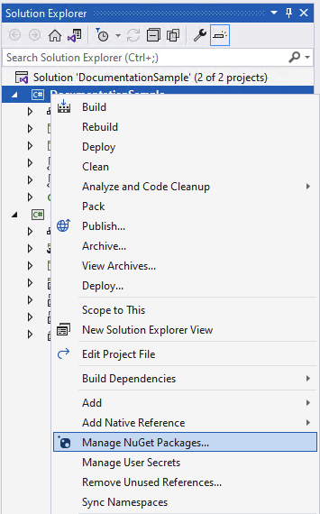

# Getting Started with the .NET Multi-platform App UI (.NET MAUI) Community Toolkit

The toolkit is available as a set of NuGet packages that can be added to any existing or new project using Visual Studio.

[!INCLUDE [docs under construction](~/includes/preview-note.md)]

1. Open an existing project, or create a new project as per the [.NET MAUI setup documentation](/dotnet/maui/get-started/first-app)

2. In the Solution Explorer panel, right click on your project name and select **Manage NuGet Packages**. Search for **CommunityToolkit.Maui**, and choose the desired NuGet Package from the list.

    

3. To add the namespace to the toolkit:

    * In your C# page, add:

        ```c#
        using CommunityToolkit.Maui;
        ```

    * In your XAML page, add the namespace attribute:

        ```xaml
        xmlns:toolkit="http://schemas.microsoft.com/dotnet/2022/maui/tookit"
        ```

4. Check out the rest of the documentation to learn more about implementing specific features.

## NuGet packages

The .NET MAUI Community Toolkit comprises of 3 separate packages:

### CommunityToolkit.Maui

**Package name:** `CommunityToolkit.Maui`

**Package url:** https://www.nuget.org/packages/CommunityToolkit.Maui

**Using:**

```c#
using CommunityToolkit.Maui;
```

This package is a collection of Animations, Behaviors, Converters, and Custom Views for development with .NET MAUI. It simplifies and demonstrates common developer tasks building iOS, Android, macOS and Windows apps with .NET MAUI.

### CommunityToolkit.Maui.Core

**Package name:** `CommunityToolkit.Maui.Core`

**Package url:** https://www.nuget.org/packages/CommunityToolkit.Maui.Core

**Using:**

```c#
using CommunityToolkit.Maui.Core;
```

This package includes the core library definitions for community toolkits using .NET MAUI.

### CommunityToolkit.Maui.Markup

**Package name:** `CommunityToolkit.Maui.Markup`

**Package url:** https://www.nuget.org/packages/CommunityToolkit.Maui.Markup

**Using:**

```c#
using CommunityToolkit.Maui.Markup;
```

This package is a set of fluent helper methods and classes to simplify building declarative .NET MAUI user interfaces in C#.

## Other resources

Download the [.NET MAUI Community Toolkit Sample App](https://github.com/CommunityToolkit/Maui) from the repository to see how to use the toolkit within an actual application.

We recommend developers who are new to .NET MAUI to visit the [.NET MAUI](/dotnet/maui/) documentation.

Visit the [.NET MAUI Community Toolkit GitHub Repository](https://github.com/CommunityToolkit/Maui) to see the current source code, what is coming next, and clone the repository.  Community contributions are welcome!