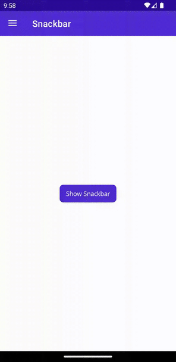
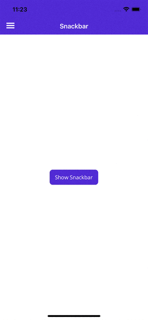

# Snackbar

The `Snackbar` is a timed alert that appears at the bottom of the screen by default. It is dismissed after a configurable duration of time. `Snackbar` is fully customizable and can be anchored to any `IView`.

The `Snackbar` informs users of a process that an app has performed or will perform. It appears temporarily, towards the bottom of the screen.

## Syntax

The `Snackbar` is invoked using C#.

### C#

To display `Snackbar` you need to create it, using the static method `Make`:

```csharp
using CommunityToolkit.Maui.Alerts;

CancellationTokenSource cancellationTokenSource = new CancellationTokenSource();

var snackbarOptions = new SnackbarOptions
{
    BackgroundColor = Colors.Red,
    TextColor = Colors.Green,
    ActionButtonTextColor = Colors.Yellow,
    CornerRadius = new CornerRadius(10),
    Font = Font.SystemFontOfSize(14),
    ActionButtonFont = Font.SystemFontOfSize(14),
    CharacterSpacing = 0.5
};

string text = "This is a Snackbar";
string actionButtonText = "Click Here to Dismiss";
Action action = async () => await DisplayAlert("Snackbar ActionButton Tapped", "The user has tapped the Snackbar ActionButton", "OK");
TimeSpan duration = TimeSpan.FromSeconds(3);

var snackbar = Snackbar.Make(text, action, actionButtonText, duration, snackbarOptions);

await snackbar.Show(cancellationTokenSource.Token);
```

When calling `Snackbar.Make()`, its parameter `string text` is required. All other parameters are optional.

The following screenshot shows the resulting Snackbar:
# [Android](#tab/android)



# [iOS](#tab/ios)



---

There is also an extension method, which will anchor the `Snackbar` to any `VisualElement`:

```csharp
await MyVisualElement.DisplaySnackbar("Snackbar is awesome. It is anchored to MyVisualElement");
```

`SnackBar` contains two events:

- `public static event EventHandler Shown`
- `public static event EventHandler Dismissed`

It also contains the property `public static bool IsShown { get; }`.

```csharp
Snackbar.Shown += (s, e) => { Console.WriteLine(Snackbar.IsShown); };
Snackbar.Dismissed += (s, e) => { Console.WriteLine(Snackbar.IsShown); };
```

## Properties

|Property  |Type  |Description  |
|---------|---------|---------|
| Text | `string` | Text message. **Required** |
| Action | `Action` | Action to invoke on action button click. |
| ActionButtonText | `string` | Action button text. |
| Anchor | `IView` | `Snackbar` anchor. `Snackbar` appears near this view. When `null`, the `Snackbar` will appear at the bottom of the screen. |
| Duration | `TimeSpan` | `Snackbar` duration. |
| VisualOptions | `SnackbarOptions` | `Snackbar` visual options. |

### SnackbarOptions

The `SnackbarOptions` allows customize the default `Snackbar` style.

#### Properties

|Property  |Type  |Description  |Default value
|---------|---------|---------|---------|
| CharacterSpacing | `double` | Message character spacing. | `0.0d` |
| Font | `Font` | Message font. | `Font.SystemFontOfSize(14)` |
| TextColor | `Color` | Message text color. | `Colors.Black` |
| ActionButtonFont | `Font` | Action button font. | `Font.SystemFontOfSize(14)` |
| ActionButtonTextColor | `Color` | Action button text color. | `Colors.Black` |
| BackgroundColor | `Color` | Background color. | `Colors.LightGray` |
| CornerRadius | `CornerRadius` | Corner radius. | `new CornerRadius(4, 4, 4, 4)` |

## Methods

|Method  |Description  |
|---------|---------|
| Show | Display the requested `Snackbar`. This will dismiss any currently displayed `Snackbar`|
| Dismiss | Dismiss the requested `Snackbar`. |

> [!NOTE]
> You can display only 1 `Snackbar` at the same time. If you call the `Show` method a second time, the first `Snackbar` will automatically be dismissed before the second `Snackbar` is shown.

## Examples

You can find an example of this feature in action in the [.NET MAUI Community Toolkit Sample Application](https://github.com/CommunityToolkit/Maui/blob/main/samples/CommunityToolkit.Maui.Sample/Pages/Alerts/SnackbarPage.xaml.cs).

## API

You can find the source code for `Snackbar` over on the [.NET MAUI Community Toolkit GitHub repository](https://github.com/CommunityToolkit/Maui/blob/main/src/CommunityToolkit.Maui/Alerts/Snackbar).

## Details of implementation and limitation for different platforms

1. The API allows override existing methods with your own implementation or even create your own Snackbar, by implementing `ISnackbar` interface.
2. "Native" Snackbar is available only on Android and created by Google. Other platforms use "Container" (`UIView` for iOS and MacCatalyst, `ToastNotification` on Windows).
3. `Snackbar` on Windows can't be anchored to `VisualElement` and is always displayed as a default Windows Notification.

### WinUI specifics

`ToastNotification` which is used to show `Snackbar` on Windows has 2 types of activation: foreground and background.

More info about handling activation: [Send a local toast notification from C# apps](/windows/apps/design/shell/tiles-and-notifications/send-local-toast?tabs=uwp#step-3-handling-activation) 

Foreground activation type is used in `CommunityToolkit.Maui` library. That means, whenever a notification is shown a new instance of application is executed. It is up to the developer how to handle such situations. Here are a few suggestions:

1. Use Single Application Instance.

    That means, whenever the user clicks on the `ToastNotification`, the new instance of the application (new process) checks if there is already a process running for our app and if any, the new process that was created by the notification is killed.

    Add the next code to `Platform\Windows\App.xaml.cs`:

    ```csharp
    static Mutex? mutex;

    protected override void OnLaunched(LaunchActivatedEventArgs args)
    {
        if (!IsSingleInstance())
        {
            Process.GetCurrentProcess().Kill();
        }
        else
        {
            base.OnLaunched(args);
        }
    }

    static bool IsSingleInstance()
    {
        const string applicationId = "YOUR_APP_ID_FROM_CSPROJ";
        mutex = new Mutex(false, applicationId);
        GC.KeepAlive(mutex);

        try
        {
            return mutex.WaitOne(0, false);
        }
        catch (AbandonedMutexException)
        {
            mutex.ReleaseMutex();
            return mutex.WaitOne(0, false);
        }
    }
    ```

2. Using external NuGet package.

    With this approach application registers new service which monitors `ToastNotification` activation. Works with Windows 10.0.18362 and later.

    1. Install `CommunityToolkit.WinUI.Notifications`.
    2. Add the next code to `Platform\Windows\App.xaml.cs`:

    ```csharp
    protected override void OnLaunched(LaunchActivatedEventArgs args)
    {
        ToastNotificationManagerCompat.OnActivated += ToastNotificationManagerCompat_OnActivated;
        base.OnLaunched(args);
    }

    void ToastNotificationManagerCompat_OnActivated(ToastNotificationActivatedEventArgsCompat e)
    {
        // Handle ToastNotificationEvent.
    }
    ```

    3. Update `Platform\Windows\Package.appxmanifest`:
    
    ```xml
    <?xml version="1.0" encoding="utf-8"?>
    <Package
    xmlns="http://schemas.microsoft.com/appx/manifest/foundation/windows10"
    xmlns:uap="http://schemas.microsoft.com/appx/manifest/uap/windows10"
    xmlns:rescap="http://schemas.microsoft.com/appx/manifest/foundation/windows10/restrictedcapabilities"
    xmlns:desktop="http://schemas.microsoft.com/appx/manifest/desktop/windows10" 
    xmlns:com="http://schemas.microsoft.com/appx/manifest/com/windows10"
    IgnorableNamespaces="uap rescap com desktop">

    ...

    <Applications>
        <Application Id="App" Executable="$targetnametoken$.exe" EntryPoint="$targetentrypoint$">
        <uap:VisualElements />
        <Extensions>

            <!-- Specify which CLSID to activate when toast clicked -->
            <desktop:Extension Category="windows.toastNotificationActivation">
                <desktop:ToastNotificationActivation ToastActivatorCLSID="YOUR_APP_ID_FROM_CSPROJ" /> 
            </desktop:Extension>

            <!--Register COM CLSID LocalServer32 registry key-->
            <com:Extension Category="windows.comServer">
                <com:ComServer>
                    <com:ExeServer Executable="YOUR_APP_NAME.exe" Arguments="-ToastActivated" DisplayName="Toast activator">
                        <com:Class Id="YOUR_APP_ID_FROM_CSPROJ" DisplayName="Toast activator"/>
                    </com:ExeServer>
                </com:ComServer>
            </com:Extension>

        </Extensions>
        </Application>
    </Applications>

    </Package>
    ```
