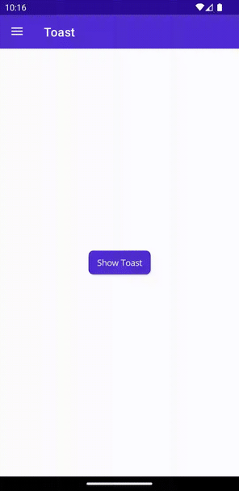
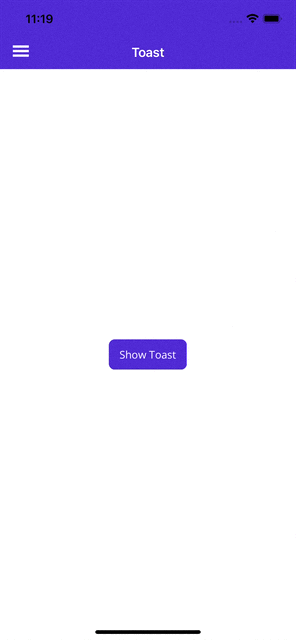

# Toast

`Toast` is a timed alert that appears at the bottom of the screen. It is automatically dismissed after a configurable duration of time.

It provides simple feedback to the user about an operation in a small alert.

## Syntax

### C#

To display `Toast`, first create it using the static method `Toast.Make()`, then display it using its method `Show()`.

```csharp
using CommunityToolkit.Maui.Alerts;

CancellationTokenSource cancellationTokenSource = new CancellationTokenSource();

string text = "This is a Toast";
ToastDuration duration = ToastDuration.Short;
double fontSize = 14;

var toast = Toast.Make(text, duration, fontSize);

await toast.Show(cancellationTokenSource.Token);
```

When calling `Toast.Make()`, its parameter `string text` is required. All other parameters are optional. Its optional parameter `ToastDuration duration` uses the default duration of `ToastDuration.Short`. Its optional parameter `double fontSize` uses the default value of `14.0`.

The following screenshot shows the resulting Toast:
### [Android](#tab/android)



### [iOS](#tab/ios)



---

## Properties

|Property  |Type  |Description  |Default value
|---------|---------|---------| ---------- |
| Text | `string` | Text that displayed in the `Toast`. | **Required**
| Duration | `ToastDuration` | Duration `Toast` displayed. | `ToastDuration.Short` |
| TextSize | `double` | Text font size. | `14.0` |

### ToastDuration

The `ToastDuration` enumeration defines the following members:

- `Short` - Display `Toast` for 2 seconds
- `Long` - Display `Toast` for 3.5 seconds

These values adhere to the constants defined in the [`android.widget.Toast` API](https://developer.android.com/reference/android/widget/Toast).

## Methods

|Method  |Description  |
|---------|---------|
| Show | Display the requested `Toast`. If a `Toast` is currently displayed, it will automatically be dismissed before the requested `Toast` is displayed. |
| Dismiss | Dismiss the current toast. |

> [!NOTE]
> You can display only one `Toast` at a time. If you call the `Show` method a second time, the first `Toast` will automatically be dismissed.

## Examples

You can find an example of this feature in action in the [.NET MAUI Community Toolkit Sample Application](https://github.com/CommunityToolkit/Maui/blob/main/samples/CommunityToolkit.Maui.Sample/Pages/Alerts/ToastPage.xaml.cs).

## API

You can find the source code for `Toast` over on the [.NET MAUI Community Toolkit GitHub repository](https://github.com/CommunityToolkit/Maui/blob/main/src/CommunityToolkit.Maui/Alerts/Toast).

## Details of implementation and limitation for different platforms

1. The API allows override existing methods with your own implementation or creating your own Toast, by implementing `IToast` interface.
2. Toast is implemented on Android, created by Google. Other platforms use a custom-implemented container (`UIView` for iOS and MacCatalyst, `ToastNotification` on Windows).
3. Toast on Tizen can't be customized with its `Duration` and `TextSize` properties.
