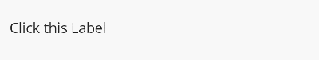

# AnimationBehavior

The `AnimationBehavior` is a `Behavior` that provides the ability to animate any `VisualElement` it is attached to. Setting `AnimateOnTap` to `true` adds a `TapGestureRecognizer` to the `VisualElement` and triggers the associated animation when that recognizer detects that the user has tapped or clicked on the `VisualElement`.

The `AnimationType` property is required to be set, possible options for this can be found at [Animations](../animations/index.md).

[!INCLUDE [important note on bindings within behaviors](../includes/behavior-bindings.md)]

## Syntax

The following examples show how to add the `AnimationBehavior` to a `Label` and use the `FadeAnimation` to animate a change in opacity.

### XAML

#### Including the XAML namespace

[!INCLUDE [XAML usage guidance](../includes/xaml-usage.md)]

#### Using the AnimationBehavior

```xaml
<ContentPage 
    xmlns="http://schemas.microsoft.com/dotnet/2021/maui"
    xmlns:x="http://schemas.microsoft.com/winfx/2009/xaml"
    xmlns:toolkit="http://schemas.microsoft.com/dotnet/2022/maui/toolkit"
    x:Class="CommunityToolkit.Maui.Sample.Pages.Behaviors.AnimationBehaviorPage"
    x:Name="Page">

    <Label Text="Click this Label">
        <Label.Behaviors>
            <toolkit:AnimationBehavior AnimateOnTap="True">
                <toolkit:AnimationBehavior.AnimationType>
                    <toolkit:FadeAnimation Opacity="0.5" />
                </toolkit:AnimationBehavior.AnimationType>
            </toolkit:AnimationBehavior>
        </Label.Behaviors>
    </Label>

</ContentPage>
```

### C#

The `AnimationBehavior` can be used as follows in C#:

```csharp
class AnimationBehaviorPage : ContentPage
{
    public AnimationBehaviorPage()
    {
        var label = new Label
        {
            Text = "Click this Label"
        };

        var animationBehavior = new AnimationBehavior
        {
            AnimateOnTap = true, 
            AnimationType = new FadeAnimation
            {
                Opacity = 0.5
            }
        };

        label.Behaviors.Add(animationBehavior);

        Content = label;
    }
}
```

### C# Markup

Our [`CommunityToolkit.Maui.Markup`](../markup/markup.md) package provides a much more concise way to use this `Behavior` in C#.

```csharp
using CommunityToolkit.Maui.Markup;

class AnimationBehaviorPage : ContentPage
{
    public AnimationBehaviorPage()
    {
        Content = new Label()
            .Text("Click this label")
            .Behaviors(new AnimationBehavior
            {
                AnimateOnTap = true,
                AnimationType = new FadeAnimation
                {
                    Opacity = 0.5
                }
            });
    }
}
```

The following screenshot shows the resulting AnimationBehavior on Android:


## Additional examples

### Handling the user interaction

The `AnimationBehavior` responds to taps and clicks by the user, it is possible to handle this interaction through the `Command` property on the behavior.

The following example shows how to attach the `AnimationBehavior` to an `Image` and bind the `Command` property to a property on a view model.

#### View

```xaml
<Image Source="thumbs-up.png" x:Name="ThumbsUpImage">
    <Image.Behaviors>
        <toolkit:AnimationBehavior 
            Command="{Binding ThumbsUpCommand}"
            BindingContext="{Binding Path=BindingContext, Source={x:Reference ThumbsUpImage}, x:DataType=Image}">
            <toolkit:AnimationBehavior.AnimationType>
                <toolkit:FadeAnimation />
            </toolkit:AnimationBehavior.AnimationType>
        </toolkit:AnimationBehavior>
    </Image.Behaviors>
</Image>
```

#### View model

```csharp

public ICommand ThumbsUpCommand { get; }

public MyViewModel()
{
    ThumbsUpCommand = new Command(() => OnThumbsUp())
}

public void OnThumbsUp()
{
    // perform the thumbs up logic.
}
```

### Programmatically triggering the animation

The `AnimationBehavior` provides the ability to trigger animations programmatically. The `AnimateCommand` can be executed to trigger the associated animation type.

The following example shows how to add the `AnimationBehavior` to an `Entry`, bind the `AnimatedCommand` and then execute the command from a view model.

#### View

```xaml
<Entry Placeholder="First name (Required)"
       Text="{Binding FirstName}"
       x:Name="FirstNameEntry">
    <Entry.Behaviors>
        <toolkit:AnimationBehavior 
            AnimateCommand="{Binding TriggerAnimationCommand}"
            BindingContext="{Binding Path=BindingContext, Source={x:Reference FirstNameEntry}, x:DataType=Entry}">
            <toolkit:AnimationBehavior.AnimationType>
                <toolkit:FadeAnimation />
            </toolkit:AnimationBehavior.AnimationType>
        </toolkit:AnimationBehavior>
    </Entry.Behaviors>
</Entry>
```

#### View model

```csharp
private string firstName;

public string FirstName
{
    get => firstName;
    set => SetProperty(ref firstName, value);
}

public ICommand TriggerAnimationCommand { get; set; }

public void Save()
{
    if (string.IsNullOrEmpty(FirstName))
    {
        TriggerAnimationCommand.Execute(CancellationToken.None);
        return;
    }

    // save code.
}
```

> [!NOTE]
> The `AnimateCommand` property is read-only and expects a binding mode of `BindingMode.OneWayToSource`. You also do not need to assign a value to the command property in your view model (`TriggerAnimationCommand` in the example above), this is because the binding will assign the value to your property from the value created in the `AnimationBehavior`.

This provides the ability to trigger an animation from within a view model.

### Triggering the animation from control events

The `AnimationBehavior` provides the same underlying features as the [`EventToCommandBehavior`](event-to-command-behavior.md). Through the use of the `EventName` property, the associated animation type can be triggered when an event matching the supplied name is raised.

Using the following example animation implementation:

```csharp
class SampleScaleToAnimation : BaseAnimation
{
    public double Scale { get; set; }

    public override Task Animate(VisualElement view) => view.ScaleTo(Scale, Length, Easing);
}
```

The following example shows how we can assign two `AnimationBehavior` instances to an `Entry`; one to trigger an animation when the **Focused** event is raised, and another to trigger a different animation when the **Unfocused** event is raised.

```xaml
<Entry Placeholder="Animate on Focused and Unfocused">
    <Entry.Behaviors>
        <toolkit:AnimationBehavior EventName="Focused">
            <toolkit:AnimationBehavior.AnimationType>
                <behaviorPages:SampleScaleToAnimation 
                    Easing="{x:Static Easing.Linear}"
                    Length="100"
                    Scale="1.05"/>
            </toolkit:AnimationBehavior.AnimationType>
        </toolkit:AnimationBehavior>

        <toolkit:AnimationBehavior EventName="Unfocused">
            <toolkit:AnimationBehavior.AnimationType>
                <behaviorPages:SampleScaleToAnimation 
                    Easing="{x:Static Easing.Linear}"
                    Length="100"
                    Scale="1"/>
            </toolkit:AnimationBehavior.AnimationType>
        </toolkit:AnimationBehavior>
    </Entry.Behaviors>
</Entry>
```

## Examples

You can find an example of this behavior in action in the [.NET MAUI Community Toolkit Sample Application](https://github.com/CommunityToolkit/Maui/blob/main/samples/CommunityToolkit.Maui.Sample/Pages/Behaviors/AnimationBehaviorPage.xaml).

## API

You can find the source code for `AnimationBehavior` over on the [.NET MAUI Community Toolkit GitHub repository](https://github.com/CommunityToolkit/Maui/blob/main/src/CommunityToolkit.Maui/Behaviors/AnimationBehavior.shared.cs).

## Useful links

- [.NET MAUI Community Toolkit Behaviors](../animations/index.md)
- [Creating custom animations](../animations/index.md#creating-custom-animations)
