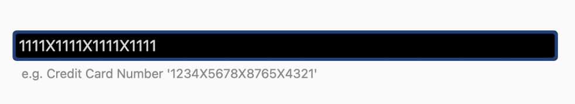

# MaskedBehavior

The `MaskedBehavior` is a `Behavior` that allows the user to define an input mask for data entry. Adding this behavior to an `InputView` (e.g. an `Entry`) control will force the user to only input values matching a given mask. Examples of its usage include input of a credit card number or a phone number.

## Syntax

The following examples show how to add the `MaskedBehavior` to an `Entry` to aid a user when entering a 16 digit credit card number.

### XAML

#### Including the XAML namespace

[!INCLUDE [XAML usage guidance](../includes/xaml-usage.md)]

#### Using the MaskedBehavior

The `MaskedBehavior` can be used as follows in XAML:

```xaml
<ContentPage xmlns="http://schemas.microsoft.com/dotnet/2021/maui"
             xmlns:x="http://schemas.microsoft.com/winfx/2009/xaml"
             xmlns:toolkit="http://schemas.microsoft.com/dotnet/2022/maui/toolkit"
             x:Class="CommunityToolkit.Maui.Sample.Pages.Behaviors.MaskedBehaviorPage">

    <Entry Keyboard="Numeric">
        <Entry.Behaviors>
            <toolkit:MaskedBehavior Mask="XXXX XXXX XXXX XXXX" />
        </Entry.Behaviors>
    </Entry>

</ContentPage>
```

### C#

The `MaskedBehavior` can be used as follows in C#:

```csharp

class MaskedBehaviorPage : ContentPage
{
    public MaskedBehaviorPage()
    {
        var entry = new Entry
        {
            Keyboard = Keyboard.Numeric
        };

        var behavior = new MaskedBehavior
        {
            Mask = "XXXX XXXX XXXX XXXX"
        };

        entry.Behaviors.Add(behavior);

        Content = entry;
    }
}
```

### C# Markup

Our [`CommunityToolkit.Maui.Markup`](../markup/markup.md) package provides a much more concise way to use this `Behavior` in C#.

```csharp
using CommunityToolkit.Maui.Markup;

class MaskedBehaviorPage : ContentPage
{
    public MaskedBehaviorPage()
    {
        Content = new Entry
        {
            Keyboard = Keyboard.Numeric
        }.Behaviors(new MaskedBehavior
        {
            Mask = "XXXX XXXX XXXX XXXX"
        });
    }
}
```

The following screenshot shows the resulting MaskedBehavior on Android:


## Custom prompt character

It is possible to override the character in the `Mask` property that will be visible to the user. This can be changed by setting the `UnmaskedCharacter` property which defaults to `'X'`. So for example if an `X` was required to be displayed in between each group of 4 digits in our 16 digit credit card entry the following could be used:

```xml
<Entry Keyboard="Numeric">
    <Entry.Behaviors>
        <toolkit:MaskedBehavior Mask="0000X0000X0000X0000" UnmaskedCharacter="0" />
    </Entry.Behaviors>
</Entry>
```



## Properties

|Property  |Type  |Description  |
|---------|---------|---------|
| `Mask` | `string` | The mask that the input value needs to match. |
| `UnmaskedCharacter` | `char` | Defines which character in the `Mask` property that will be visible and entered by a user. |

## Examples

You can find an example of this behavior in action in the [.NET MAUI Community Toolkit Sample Application](https://github.com/CommunityToolkit/Maui/blob/main/samples/CommunityToolkit.Maui.Sample/Pages/Behaviors/MaskedBehaviorPage.xaml).

## API

You can find the source code for `MaskedBehavior` over on the [.NET MAUI Community Toolkit GitHub repository](https://github.com/CommunityToolkit/Maui/blob/main/src/CommunityToolkit.Maui/Behaviors/MaskedBehavior.shared.cs).