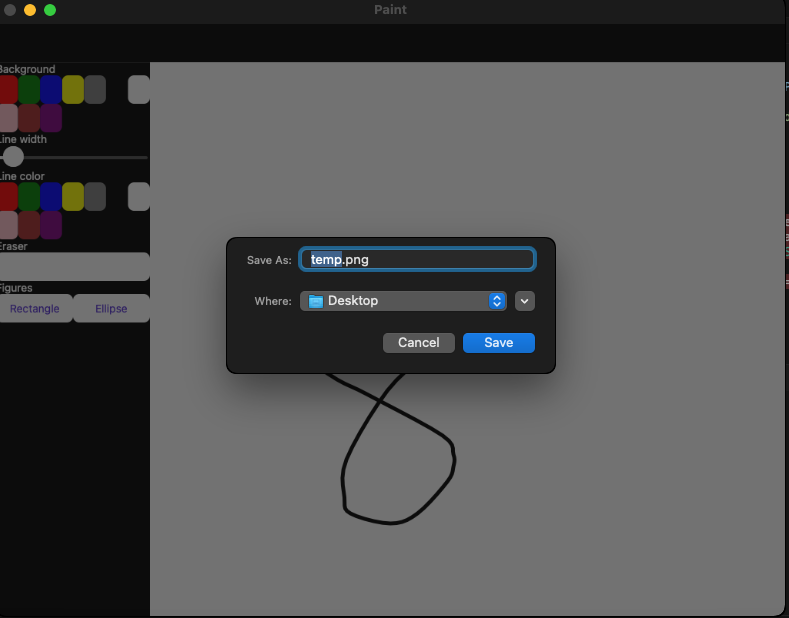

# FileSaver

The `FileSaver` provides the ability to select target folder and save files to the file system.



The following preconditions required for the `FileSaver`:
# [Android](#tab/android)

Add permissions to `AndroidManifest.xml`:

```xml
<uses-permission android:name="android.permission.READ_EXTERNAL_STORAGE" />
<uses-permission android:name="android.permission.WRITE_EXTERNAL_STORAGE" />
```

# [iOS/MacCatalyst](#tab/ios)

Nothing is needed.

# [Windows](#tab/windows)

Nothing is needed.

# [Tizen](#tab/tizen)

Add permissions to `tizen-manifest.xml`:

```xml
<privilege>http://tizen.org/privilege/mediastorage</privilege>
<privilege>http://tizen.org/privilege/externalstorage</privilege>
```

---

## Syntax

### C#

The `FileSaver` can be used as follows in C#:

```csharp
async Task SaveFile(CancellationToken cancellationToken)
{
    using var stream = new MemoryStream(Encoding.Default.GetBytes("Hello from the Community Toolkit!"));
    var fileSaverResult = await FileSaver.Default.SaveAsync("test.txt", stream, cancellationToken);
    if (fileSaverResult.IsSuccessful)
    {
        await Toast.Make($"The file was saved successfully to location: {fileSaverResult.FilePath}").Show(cancellationToken);
    }
    else
    {
        await Toast.Make($"The file was not saved successfully with error: {fileSaverResult.Exception.Message}").Show(cancellationToken);
    }
}
```

## Methods

|Method  |Description  |
|---------|---------|
| SaveAsync | Asks for permission, allows selecting a folder and saving file to the file system. |

### FileSaverResult

The result returned from the `SaveAsync` method. This can be used to verify whether the save was successful, check where the file was saved and also access any exceptions that may have ocurred during the save.

#### Properties

|Property  |Type  |Description  |
|---------|---------|---------|
| FilePath | `string` | The location on disk where the file was saved. |
| Exception | `Exception` | Gets the `Exception` if the save operation failed. |
| IsSuccessful | `bool` | Gets a value determining whether the operation was successful. |

#### Methods

|Method  |Description  |
|---------|---------|
| EnsureSuccess | Verifies whether the save operation was successful. |

> [!WARNING]
> `EnsureSuccess` will throw an `Exception` if the save operation was unsuccessful.

## Dependency Registration

In case you want to inject service, you first need to register it.
Update `MauiProgram.cs` with the next changes:

```csharp
public static class MauiProgram
{
    public static MauiApp CreateMauiApp()
    {
        var builder = MauiApp.CreateBuilder();
        builder
            .UseMauiApp<App>()
			.UseMauiCommunityToolkit();

		builder.Services.AddSingleton<IFileSaver>(FileSaver.Default);
        return builder.Build();
    }
}
```

Now you can inject the service like this:

```csharp
public partial class MainPage : ContentPage
{
    private readonly IFileSaver fileSaver;

	public MainPage(IFileSaver fileSaver)
	{
		InitializeComponent();
        this.fileSaver = fileSaver;
	}
	
	public async void SaveFile(object sender, EventArgs args)
	{
		using var stream = new MemoryStream(Encoding.Default.GetBytes("Hello from the Community Toolkit!"));
        var fileSaverResult = await fileSaver.SaveAsync("test.txt", stream, cancellationToken);
        fileSaverResult.EnsureSuccess();
        await Toast.Make($"File is saved: {fileSaverResult.FilePath}").Show(cancellationToken);
	}
}
```

## Examples

You can find an example of `FileSaver` in action in the [.NET MAUI Community Toolkit Sample Application](https://github.com/CommunityToolkit/Maui/blob/main/samples/CommunityToolkit.Maui.Sample/Pages/Essentials/FileSaverPage.xaml).

## API

You can find the source code for `FileSaver` over on the [.NET MAUI Community Toolkit GitHub repository](https://github.com/CommunityToolkit/Maui/blob/main/src/CommunityToolkit.Maui.Core/Interfaces/IFileSaver.shared.cs).
