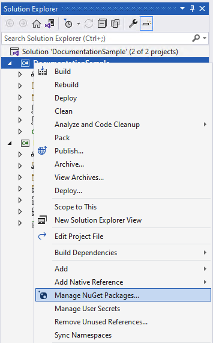

# Get started

This article covers how to get started using the packages provided as part of the .NET MAUI Community Toolkit project.

## Adding the NuGet package(s)

The toolkit is available as a set of NuGet packages that can be added to any existing or new project using Visual Studio.

1. Open an existing project, or create a new project as per the [.NET MAUI setup documentation](/dotnet/maui/get-started/first-app)

2. In the Solution Explorer panel, right click on your project name and select **Manage NuGet Packages**. Search for **CommunityToolkit.Maui**, and choose the desired NuGet Package from the list.

    

3. Choose the toolkit(s) that are most appropriate for your needs from the options below:

### [CommunityToolkit.Maui](#tab/CommunityToolkitMaui)

This package is a collection of Animations, Behaviors, Converters, and Custom Views for development with .NET MAUI. It simplifies and demonstrates common developer tasks building iOS, Android, macOS and Windows apps with .NET MAUI.

**Package name:** `CommunityToolkit.Maui`

**Package url:** https://www.nuget.org/packages/CommunityToolkit.Maui

#### Initializing the package

First the using statement needs to be added to the top of your *MauiProgram.cs* file

```csharp
using CommunityToolkit.Maui;
```

In order to use the toolkit correctly the `UseMauiCommunityToolkit` method must be called on the `MauiAppBuilder` class when bootstrapping an application the *MauiProgram.cs* file. The following example shows how to perform this.

```csharp
var builder = MauiApp.CreateBuilder();
builder
    .UseMauiApp<App>()
    .UseMauiCommunityToolkit()
```

To use the features of the toolkit please refer to the documentation pages for each specific feature.

### [CommunityToolkit.Maui.Markup](#tab/CommunityToolkitMauiMarkup)

This package is a set of fluent helper methods and classes to simplify building declarative .NET MAUI user interfaces in C#.

**Package name:** `CommunityToolkit.Maui.Markup`

**Package url:** https://www.nuget.org/packages/CommunityToolkit.Maui.Markup

#### Initializing the package

First the using statement needs to be added to the top of your *MauiProgram.cs* file

```csharp
using CommunityToolkit.Maui.Markup;
```

In order to use the toolkit correctly the `UseMauiCommunityToolkitMarkup` method must be called on the `MauiAppBuilder` class when bootstrapping an application the *MauiProgram.cs* file. The following example shows how to perform this.

```csharp
var builder = MauiApp.CreateBuilder();
builder
    .UseMauiApp<App>()
    .UseMauiCommunityToolkitMarkup()
```

To use the features of the toolkit please refer to the documentation pages for each specific feature.

### [CommunityToolkit.Maui.MediaElement](#tab/CommunityToolkitMauiMediaElement)

This package enables you to play audio and video in your .NET MAUI application.

**Package name:** `CommunityToolkit.Maui.MediaElement`

**Package url:** https://www.nuget.org/packages/CommunityToolkit.Maui.MediaElement

#### Initializing the package

First the using statement needs to be added to the top of your *MauiProgram.cs* file

```csharp
using CommunityToolkit.Maui.MediaElement;
```

In order to use the `MediaElement` correctly the `UseMauiCommunityToolkitMediaElement` method must be called on the `MauiAppBuilder` class when bootstrapping an application the *MauiProgram.cs* file. The following example shows how to perform this.

```csharp
var builder = MauiApp.CreateBuilder();
builder
    .UseMauiApp<App>()
    .UseMauiCommunityToolkitMediaElement()
```

To use the features of the toolkit please refer to the documentation pages for each specific feature.

----

## Using the NuGet package(s)

4. Enable Toolkit in `MauiProgram.cs`:

```csharp
var builder = MauiApp.CreateBuilder();
builder.UseMauiApp<App>();
builder.UseMauiCommunityToolkit();
```

4.1. For advanced settings set [CommunityToolkit.Maui.Options](./options.md):

```csharp
builder.UseMauiCommunityToolkit(options =>
{
    options.SetShouldSuppressExceptionsInConverters(false);
    options.SetShouldSuppressExceptionsInBehaviors(false);
    options.SetShouldSuppressExceptionsInAnimations(false);
});
```

5. Check out the rest of the documentation to learn more about implementing specific features.

## Other resources

Download the [.NET MAUI Community Toolkit Sample App](https://github.com/CommunityToolkit/Maui) from the repository to see how to use the toolkit within an actual application.

We recommend developers who are new to .NET MAUI to visit the [.NET MAUI](/dotnet/maui/) documentation.

Visit the [.NET MAUI Community Toolkit GitHub Repository](https://github.com/CommunityToolkit/Maui) to see the current source code, what is coming next, and clone the repository.  Community contributions are welcome!
