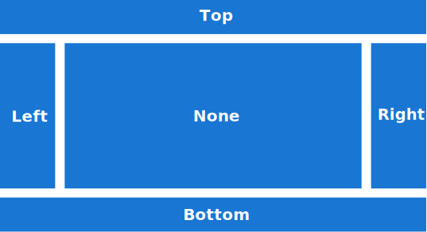

# DockLayout

`DockLayout` is a layout where views can be docked to the sides of the layout container.

The image below shows how a `DockLayout` is conceptually structured. Child views are docked at one of 4 possible docking positions: *Top*, *Bottom*, *Left* or *Right* (equivalent to `DockPosition.Top`, `DockPosition.Bottom`, `DockPosition.Left`, and `DockPosition.Right`). Views that are not explicitly docked (or with `DockPosition.None`) are displayed at the center (or between *Top* / *Bottom* and *Left* / *Right* positions).



## Building a DockLayout

The following sections cover how to use a `DockLayout` in both C# and XAML.

### XAML

#### Including the XAML namespace

[!INCLUDE [XAML usage guidance](../includes/xaml-usage.md)]

#### Using the DockLayout

A basic `DockLayout` can be created in XAML as shown here:

```xml
<ContentPage xmlns="http://schemas.microsoft.com/dotnet/2021/maui"
             xmlns:x="http://schemas.microsoft.com/winfx/2009/xaml"
             xmlns:toolkit="http://schemas.microsoft.com/dotnet/2022/maui/toolkit"
             x:Class="MyProject.MyContentPage">

    <toolkit:DockLayout>
        <Button toolkit:DockLayout.DockPosition="Top" Text="Top" HeightRequest="50" />
        <Button toolkit:DockLayout.DockPosition="Bottom" Text="Bottom" HeightRequest="70" />
        <Button toolkit:DockLayout.DockPosition="Left" Text="Left" WidthRequest="80" />
        <Button toolkit:DockLayout.DockPosition="Right" Text="Right" WidthRequest="90" />
        <Button Text="Center" />
    </toolkit:DockLayout>
    
</ContentPage>
```

For *Left* / *Right* docking, a `WidthRequest` should be specified. For *Top* / *Bottom* docking, a `HeightRequest` defines the size of the child view along the docking direction. The orthogonal directions are always calculated implicitly by the `DockLayout` manager.

### C#

A `DockLayout` can be constructed conveniently in C# as shown here:

```csharp
using CommunityToolkit.Maui.Layouts;

var page = new ContentPage
{
    Content = new DockLayout
    {
        { new Button { Text = "Top", HeightRequest = 50 }, DockPosition.Top },
        { new Button { Text = "Bottom", HeightRequest = 70 }, DockPosition.Bottom },
        { new Button { Text = "Left", WidthRequest = 80 }, DockPosition.Left },
        { new Button { Text = "Right", WidthRequest = 90 }, DockPosition.Right },
        { new Button { Text = "Center" } },
    }
};
```

Note: `DockPosition.None` is the default and can be omitted.

## Setting the dock position

To set the docking position from C#, use `DockLayout.SetDockPosition(IView, DockPosition)` to apply the attached `DockPosition` property.

```csharp
var button = new Button { Text = "Top", HeightRequest = 50 };
DockLayout.SetDockPosition(button, DockPosition.Top);
```

## Customizing a DockLayout

A `DockLayout` container supports arbitrary `Padding` as well as several `DockLayout`-specific properties for customization. An example in XAML with all available options is given here:

```xml
<ContentPage xmlns="http://schemas.microsoft.com/dotnet/2021/maui"
             xmlns:x="http://schemas.microsoft.com/winfx/2009/xaml"
             xmlns:toolkit="http://schemas.microsoft.com/dotnet/2022/maui/toolkit"
             x:Class="MyProject.MyContentPage">

    <toolkit:DockLayout HeightRequest="400"
                    WidthRequest="600"
                    Padding="10,20,30,40"
                    VerticalSpacing="10"
                    HorizontalSpacing="15"
                    ShouldExpandLastChild="False">
        ...
    </toolkit:DockLayout>
    
</ContentPage>
```

## Properties

|Property  |Type  |Description  |
|---------|---------|---------|
| `Padding` | `Thickness` | Gets or sets the padding around the layout container (inherited from `Layout`). |
| `HorizontalSpacing` | `double` | Gets or sets the **horizontal** spacing between docked views. |
| `VerticalSpacing` | `double` | Gets or sets the **vertical** spacing between docked views. |
| | | `HorizontalSpacing` and `VerticalSpacing` is applied between neighboring views in the `DockLayout`. For example, `HorizontalSpacing` is added between *Left*, *None*, and *Right* views, but also between neighboring views in the same `DockPosition` such as multiple views docked to the *Left*. `VerticalSpacing` is rendered between vertically stacked views in *Top*, *None*, and *Bottom* positions. |
| `ShouldExpandLastChild` | `bool` | If true, the last child is expanded to fill the remaining space (default: `true`). |

## Additional Notes

If `DockLayout` is used in a spatially constrained place (especially with a size specified via `HeightRequest` or `WidthRequest` on the container), precedence is given by the order in which the child views are added to the `DockLayout` container. Consequently, whenever there is not enough space for all child views to be rendered, the lowest priority children (which were added last) will be removed upon rendering. For that reason, you should always check that the size of the container covers at least the minimum size of all its child views.

## Examples

You can find an example of the `DockLayout` feature in action in the [.NET MAUI Community Toolkit Sample Application](https://github.com/CommunityToolkit/Maui/blob/main/samples/CommunityToolkit.Maui.Sample/Pages/Layouts/DockLayoutPage.xaml).

## API

You can find the source code for `DockLayout` over on the **.NET MAUI Community Toolkit GitHub repository** in [DockLayout](https://github.com/CommunityToolkit/Maui/tree/main/src/CommunityToolkit.Maui/Layouts/DockLayout.shared.cs) and [DockLayoutManager](https://github.com/CommunityToolkit/Maui/tree/main/src/CommunityToolkit.Maui.Core/Layouts/DockLayoutManager.shared.cs).
