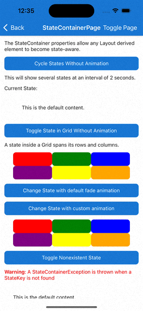

# StateContainer

Displaying a specific view when your app is in a specific state is a common pattern throughout any mobile app. Examples range from creating loading views to overlay on the screen, or on a subsection of the screen. Empty state views can be created for when there's no data to display, and error state views can be displayed when an error occurs.

## Getting Started

The `StateContainer` attached properties enables the user to turn any layout element like a `VerticalStackLayout`, `HorizontalStackLayout`, or `Grid` into a state-aware layout. Each state-aware layout contains a collection of View derived elements. These elements can be used as templates for different states defined by the user. Whenever the `CurrentState` string property is set to a value that matches the `StateKey` property of one of the View elements, its contents will be displayed instead of the main content. When `CurrentState` is set to `null` or empty string, the main content is displayed.

> [!NOTE]
> When using `StateContainer` with a `Grid`, any defined states inside it will automatically span every row and column of the `Grid`.

## Syntax

`StateContainer` properties can be used in XAML or C#.

### XAML

#### Including the XAML namespace

[!INCLUDE [XAML usage guidance](../includes/xaml-usage.md)]

#### Using the StateContainer

Below is an example UI created using XAML. This sample UI is connected to the below ViewModel, `StateContainerViewModel`.

```xml
<ContentPage xmlns="http://schemas.microsoft.com/dotnet/2021/maui"
             xmlns:x="http://schemas.microsoft.com/winfx/2009/xaml"
             xmlns:toolkit="http://schemas.microsoft.com/dotnet/2022/maui/toolkit"
             x:Class="MyProject.MyStatePage"
             BindingContext="StateContainerViewModel">

    <VerticalStackLayout 
        toolkit:StateContainer.CurrentState="{Binding CurrentState}"
        toolkit:StateContainer.CanStateChange="{Binding CanStateChange}">

        <toolkit:StateContainer.StateViews>
            <VerticalStackLayout toolkit:StateView.StateKey="Loading">
                <ActivityIndicator IsRunning="True" />
                <Label Text="Loading Content..." />
            </VerticalStackLayout>
            <Label toolkit:StateView.StateKey="Success" Text="Success!" />
        </toolkit:StateContainer.StateViews>

        <Label Text="Default Content" />
        <Button Text="Change State" Command="{Binding ChangeStateCommand}" />

    </VerticalStackLayout>

</ContentPage>
```

### C# Markup

Below is the same UI as the XAML, above, created using [C# Markup](/dotnet/communitytoolkit/maui/markup/markup).

This sample UI is connected to the below ViewModel, `StateContainerViewModel`.

```csharp
using CommunityToolkit.Maui.Layouts;
using CommunityToolkit.Maui.Markup;

BindingContext = new StateContainerViewModel();

Content = new VerticalStackLayout()
{
    new Label()
        .Text("Default Content"),
    
    new Button()
        .Text("Change State")
        .Bind(
            Button.CommandProperty,
            static (StateContainerViewModel vm) => vm.ChangeStateCommand,
            mode: BindingMode.OneTime)
}.Bind(
    StateContainer.CurrentStateProperty,
    static (StateContainerViewModel vm) => vm.CurrentState,
    static (StateContainerViewModel vm, string currentState) => vm.CurrentState = currentState)
 .Bind(
    StateContainer.CanStateChange,
    static (StateContainerViewModel vm) => vm.CanStateChange,
    static (StateContainerViewModel vm, bool canStateChange) => vm.CanStateChange = canStateChange)
 .Assign(out VerticalStackLayout layout);

var stateViews = new List<View>()
{
    //States.Loading
    new VerticalStackLayout()
    {
        new ActivityIndicator() { IsRunning = true },
        new Label().Text("Loading Content")
    },

    //States.Success
    new Label().Text("Success!")
};

StateView.SetStateKey(stateViews[0], States.Loading);
StateView.SetStateKey(stateViews[1], States.Success);

StateContainer.SetStateViews(layout, stateViews);

static class States
{
    public const string Loading = nameof(Loading);
    public const string Success = nameof(Success);
}
```

### ViewModel

When using an `ICommand` to change `CurrentState` (e.g. when using `Button.Command` to change states),
we recommended using `CanStateBeChanged` for `ICommand.CanExecute()`. 

Below is an MVVM example using the [MVVM Community Toolkit](/windows/communitytoolkit/mvvm/introduction):

```cs
[INotifyPropertyChanged]
public partial class StateContainerViewModel
{
    [ObservableProperty]
    bool canStateChange;

    [ObservableProperty]
    string currentState = States.Loading;

    [RelayCommand(CanExecute = nameof(CanStateChange))]
    void ChangeState()
    {
        CurrentState = States.Success;
    }

    partial void OnCanStateChangeChanged(bool value)
	{
		ChangeStateCommand.NotifyCanExecuteChanged();
	}
}
```

By default `StateContainer` changes state without animation. To add a custom animation you can use the `ChangeStateWithAnimation` method:

```csharp
async Task ChangeStateWithCustomAnimation()
{
    var targetState = "TargetState";
    var currentState = StateContainer.GetCurrentState(MyBindableObject);
    if (currentState == targetState)
    {
        await StateContainer.ChangeStateWithAnimation(
            MyBindableObject,
            null,
            (element, token) => element.ScaleTo(0, 100, Easing.SpringIn).WaitAsync(token),
            (element, token) => element.ScaleTo(1, 250, Easing.SpringOut).WaitAsync(token),
            CancellationToken.None);
    }
    else
    {
        await StateContainer.ChangeStateWithAnimation(
            MyBindableObject,
            targetState,
            (element, token) => element.ScaleTo(0, 100, Easing.SpringIn).WaitAsync(token),
            (element, token) => element.ScaleTo(1, 250, Easing.SpringOut).WaitAsync(token),
            CancellationToken.None);
    }
}
```

This is how it works on iOS:



## Properties

### StateContainer

The StateContainer properties can be used on any `Layout` inheriting element.

| Property | Type | Description |
|--------------------------|-------------|--------------------------------------------------------------------------------------|
| StateViews | `IList<View>` | The available `View` elements to be used as state templates. |
| CurrentState | `string` | Determines which `View` element with the corresponding `StateKey` should be displayed. <br/><br/> **Warning**: `CurrentState` cannot be changed while a state change is in progress |
| CanStateChange | `bool` | When `true`, the `CurrentState` property can be changed. When `false`, cannot be changed because it is currently changing. <br/><br/> **Warning**: If `CurrentState` is changed when `CanStateChanged` is `false`, a `StateContainerException` is thrown. |

### StateView

The StateView properties can be used on any `View` inheriting element.

| Property | Type | Description |
|--------|--------|------------------|
| StateKey | `string` | Name of the state. |

## Methods

### StateContainer

| Method | Arguments | Description |
|--------------------------|---------------|--------------------------------------------------------------------------------------|
| ChangeStateWithAnimation (static) | BindableObject bindable, string? state, Animation? beforeStateChange, Animation? afterStateChange, CancellationToken token | Change state with custom animation. |
| ChangeStateWithAnimation (static) | BindableObject bindable, string? state, Func<VisualElement, CancellationToken, Task>? beforeStateChange, Func<VisualElement, CancellationToken, Task>? afterStateChange, CancellationToken cancellationToken | Change state with custom animation. |
| ChangeStateWithAnimation (static) | BindableObject bindable, string? state, CancellationToken token | Change state using the default fade animation. |


## Examples

You can find an example of this feature in action in the [.NET MAUI Community Toolkit Sample Application](https://github.com/CommunityToolkit/Maui/blob/main/samples/CommunityToolkit.Maui.Sample/Pages/Layouts/).

## API

You can find the source code for `StateContainer` over on the [.NET MAUI Community Toolkit GitHub repository](https://github.com/CommunityToolkit/Maui/tree/main/src/CommunityToolkit.Maui/Layouts/StateContainer).
