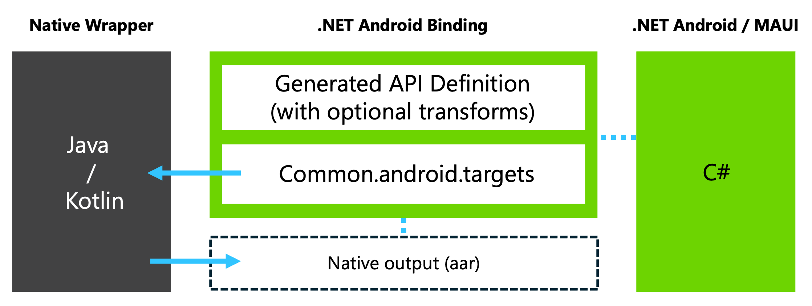
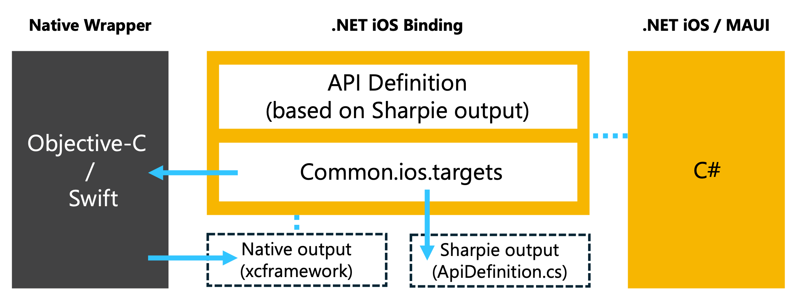

# Native Library Interop

## Overview

Native Library Interop, formerly referred to as "Slim Bindings", refers to a pattern for accessing native SDKs in .NET MAUI apps, including .NET for Android, .NET for iOS, and .NET for Mac Catalyst apps. The idea is to create your own abstraction or thin "wrapper" with a simplified API surface to the native SDKs you're interested in calling from .NET. The native "wrapper" library/framework projects get created in Android Studio using Java/Kotlin and/or Xcode using Objective-C/Swift. This approach is especially beneficial when you only need a small slice of the API surface of the SDK, though it also works well for larger API surface usage all the same.

### Understanding when and why to use Native Library Interop

Native Library Interop is a very effective approach to integrating with native libraries, though it may not always be the best fit for your project. Generally, if you are already maintaining bindings and are comfortable continuing to do so, there's no need to change approaches. For projects requiring extensive use of a library's API or for vendors supporting .NET MAUI developers, traditional bindings might still be more suitable. Native Library Interop, however, offers an alternative that is often easier to understand, implement, and maintain.

A key benefit of Native Library Interop is its effectiveness with simple API surfaces. When wrappers involve only primitive types that .NET supports, existing binding tools can generate reliable definitions with minimal manual intervention, which is often required for traditional bindings. This makes the process straightforward, especially since wrapper API implementation typically follows SDK documentation, and often allows direct copying from vendor documentation.

While the initial setup may be more intricate, managing updates to underlying SDKs generally requires less effort. Updates often involve simply adjusting the version and rebuilding the project. Even if breaking changes occur in the API surfaces or SDKs, the wrapper API surface and .NET application's usage are more likely to remain stable, requiring fewer adjustments compared to traditional bindings.

In summary, Native Library Interop provides several benefits:

- Simplifies following SDK documentation with native languages and tools
- Requires less manual intervention to create working bindings
- Makes maintenance easier and reduces the frequency of necessary updates
- Enhances isolation of the app from changes in underlying SDKs

Although resolving dependency chains (particularly on Android) may require similar effort as traditional bindings, the streamlined implementation and maintenance advantages make Native Library Interop an appealing choice for many projects.

### Understanding Maui.NativeLibraryInterop

A notable challenge with creating and maintaining bindings created via Native Library Interop is manually coalescing the native projects, their native dependencies, build outputs, and the .NET Binding library project. Maui.NativeLibraryInterop helps you jumpstart the process by building from and customizing the samples for your own app's needs.

Part of this includes orchestrating parts of the build process through MSBuild invocations. This can include:

- Resolving or downloading native SDK dependencies
- Building the native slim binding project and its dependencies
- Moving the requisite native artifacts to the expected working directory
- Generating the API definition for the binding library project

The binding build process is extended to obtain and build native SDK dependencies by adding the `CommunityToolkit.Maui.NativeLibraryInterop.BuildTasks` NuGet package to your binding project:

```xml
  <ItemGroup>
    <PackageReference Include="CommunityToolkit.Maui.BindingExtensions" Version="0.0.1-pre1" />
  </ItemGroup>
```

Android binding projects will add a `@(NLIGradleProjectReference)` item that points to the root folder that contains the native wrapper gradle project:

```xml
<ItemGroup>
    <NLIGradleProjectReference Include="../native" >
        <ModuleName>newbinding</ModuleName>
        <!-- Metadata applicable to @(AndroidLibrary) will be used if set, otherwise the following defaults will be used:
        <Bind>true</Bind>
        <Pack>true</Pack>
        -->
    </NLIGradleProjectReference>
</ItemGroup>
```

iOS binding projects will add an `@(NLIXcodeProjectReference)` item that points to the native wrapper Xcode project:

```xml
<ItemGroup>
    <NLIXcodeProjectReference Include="../native/NewBinding/NewBinding.xcodeproj">
        <SchemeName>NewBinding</SchemeName>
        <SharpieNamespace>NewBinding</SharpieNamespace>
        <SharpieBind>true</SharpieBind>
        <!-- Metadata applicable to @(NativeReference) will be used if set, otherwise the following defaults will be used:
        <Kind>Framework</Kind>
        <SmartLink>true</SmartLink>
        -->
    </NLIXcodeProjectReference>
</ItemGroup>
```

Android binding projects generate the API definition automatically taking into account any optional manual modifications like those implemented via the [Metadata.xml](https://learn.microsoft.com/xamarin/android/platform/binding-java-library/customizing-bindings/java-bindings-metadata#metadataxml-transform-file) transform file.



An iOS binding library project must include an explicitly defined API. To help with this, [Objective-Sharpie](https://learn.microsoft.com/xamarin/cross-platform/macios/binding/objective-sharpie/#overview) can be run automatically on the resulting native framework to produce an [API definition file](https://learn.microsoft.com/xamarin/cross-platform/macios/binding/objective-c-libraries?tabs=macos#The_API_definition_file) (ApiDefinition.cs) alongside it. This can serve as a helpful reference when creating and maintaining the ApiDefintion.cs file used by the iOS binding project.



The requisite native dependencies are embedded into the binding assembly. When a .NET project adds a reference to the native project, the native dependencies are included in the app automatically.
