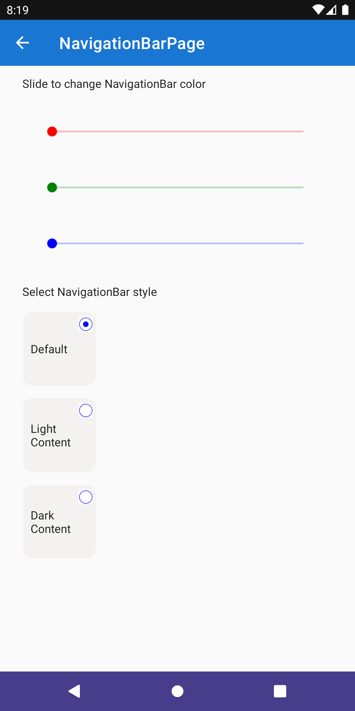

# Android NavigationBar

The `NavigationBar` provides the ability to customize the appearance of the [Navigation Bar](https://developer.android.com/design/ui/mobile/guides/foundations/system-bars#navigation-bar) on the Android platform.

The feature provides the ability to set:

## Bar Color

The `Color` property makes it possible to provide any [`Color`](xref:Microsoft.Maui.Graphics.Color) to use in setting the background color of the navigation bar.

## Bar Style

The `Style` property makes it possible to customize the foreground color of the navigation with the following allowed values:

* `Default` - this is the default and will make use of the system theme settings.
* `LightContent` - the foreground will apply the light theme color.
* `DarkContent` - the foreground will apply the dark theme color.

## Syntax

The following examples show how to use the `NavigationBar` to set the background color to `DarkSlateBlue` and the foreground style to `LightContent`.



### XAML

#### Including the XAML namespace

> [!NOTE]
> This is a different namespace to the standard toolkit namespace due to the platform specific nature of the feature and its usage.

In order to use this feature in XAML the following `xmlns` needs to be added into your page or view:

```xaml
xmlns:droid="clr-namespace:CommunityToolkit.Maui.PlatformConfiguration.AndroidSpecific;assembly=CommunityToolkit.Maui"
```

Therefore the following:

```xaml
<ContentPage
    x:Class="CommunityToolkit.Maui.Sample.Pages.NavigationBarPage"
    xmlns="http://schemas.microsoft.com/dotnet/2021/maui"
    xmlns:x="http://schemas.microsoft.com/winfx/2009/xaml">

</ContentPage>
```

Would be modified to include the `xmlns` as follows:

```xaml
<ContentPage
    x:Class="CommunityToolkit.Maui.Sample.Pages.NavigationBarPage"
    xmlns="http://schemas.microsoft.com/dotnet/2021/maui"
    xmlns:x="http://schemas.microsoft.com/winfx/2009/xaml"
    xmlns:droid="clr-namespace:CommunityToolkit.Maui.PlatformConfiguration.AndroidSpecific;assembly=CommunityToolkit.Maui">

</ContentPage>
```

#### Using the NavigationBar

The `NavigationBar` can be used as follows in XAML:

```xaml
<ContentPage 
    xmlns="http://schemas.microsoft.com/dotnet/2021/maui"
    xmlns:x="http://schemas.microsoft.com/winfx/2009/xaml"
    xmlns:droid="clr-namespace:CommunityToolkit.Maui.PlatformConfiguration.AndroidSpecific;assembly=CommunityToolkit.Maui"
    x:Class="CommunityToolkit.Maui.Sample.Pages.NavigationBarPage"
    droid:NavigationBar.Color="DarkSlateBlue"
    droid:NavigationBar.Style="LightContent">
    
</ContentPage>
```

### C#

The `NavigationBar` can be used as follows in C#:

```csharp
using CommunityToolkit.Maui.PlatformConfiguration.AndroidSpecific;

class NavigationBarPage : ContentPage
{
    public NavigationBarPage()
    {
	this.On<Android>().SetColor(Colors.Purple);
	this.On<Android>().SetStyle(NavigationBarStyle.DarkContent);
    }
}
```

## Examples

You can find an example of this feature in action in the [.NET MAUI Community Toolkit Sample Application](https://github.com/CommunityToolkit/Maui/blob/main/samples/CommunityToolkit.Maui.Sample/Pages/PlatformSpecific/NavigationBarPage.xaml).

## API

You can find the source code for `NavigationBar` over on the [.NET MAUI Community Toolkit GitHub repository](https://github.com/CommunityToolkit/Maui/blob/main/src/CommunityToolkit.Maui/PlatformConfiguration/AndroidSpecific/NavigationBar.Impl.android.cs).
