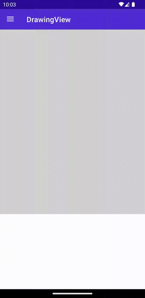
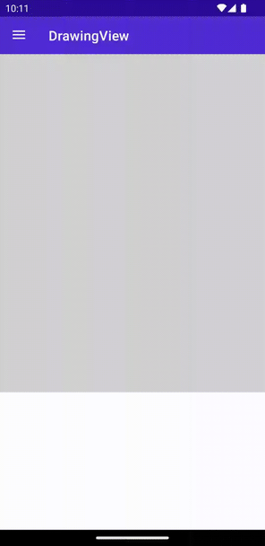

# DrawingView

The `DrawingView` provides a surface that allows for the drawing of lines through the use of touch or mouse interaction. The result of a users drawing can be saved out as an image.
A common use case for this is to provide a signature box in an application.

## Basic usage

`DrawingView` allows to set line color, line width and bind to the collection of lines.

### XAML

#### Including the XAML namespace

[!INCLUDE [XAML usage guidance](../includes/xaml-usage.md)]

#### Using the DrawingView

```xml
<toolkit:DrawingView
            Lines="{Binding MyLines}"
            LineColor="Red"
            LineWidth="5" />
```

### C#

```csharp
using CommunityToolkit.Maui.Views;

var drawingView = new DrawingView
{
    Lines = new ObservableCollection<IDrawingLine>(),
    LineColor = Colors.Red,
    LineWidth = 5
};
```

The following screenshot shows the resulting DrawingView on Android:



## MultiLine usage

By default `DrawingView` supports only 1 line. To enable `MultiLine` set `IsMultiLineModeEnabled` to true. Make sure `ShouldClearOnFinish` is false.

### XAML

```xml
<views:DrawingView
            Lines="{Binding MyLines}"
            IsMultiLineModeEnabled="true"
            ShouldClearOnFinish="false" />
```

### C#

```csharp
using CommunityToolkit.Maui.Views;

var gestureImage = new Image();
var drawingView = new DrawingView
{
    Lines = new ObservableCollection<IDrawingLine>(),
    IsMultiLineModeEnabled = true,
    ShouldClearOnFinish = false,
};
```

The following screenshot shows the resulting DrawingView on Android:



## Handle event when DrawingLineCompleted

`DrawingView` allows to subscribe to the events like `DrawingLineCompleted`. The corresponding command `DrawingLineCompletedCommand` is also available.

### XAML
```xml
<views:DrawingView
            Lines="{Binding MyLines}"
            DrawingLineCompletedCommand="{Binding DrawingLineCompletedCommand}"
            DrawingLineCompleted="OnDrawingLineCompletedEvent" />
```

### C#

```csharp
using CommunityToolkit.Maui.Views;

var gestureImage = new Image();
var drawingView = new DrawingView
{
    Lines = new ObservableCollection<IDrawingLine>(),
    DrawingLineCompletedCommand = new Command<IDrawingLine>(async (line) =>
    {
        var stream = await line.GetImageStream(gestureImage.Width, gestureImage.Height, Colors.Gray.AsPaint());
        gestureImage.Source = ImageSource.FromStream(() => stream);
    })
};
drawingView.DrawingLineCompleted += async (s, e) =>
{
    var stream = await e.LastDrawingLine.GetImageStream(gestureImage.Width, gestureImage.Height, Colors.Gray.AsPaint());
    gestureImage.Source = ImageSource.FromStream(() => stream);
};
```

## Advanced usage

To get the full benefits, the `DrawingView` provides the methods to get the image stream of the drawing lines.
### XAML

```xml
<toolkit:DrawingView
            x:Name="DrawingViewControl"
            Lines="{Binding MyLines}"
            IsMultiLineModeEnabled="true"
            ShouldClearOnFinish="true"
            DrawingLineCompletedCommand="{Binding DrawingLineCompletedCommand}"
            DrawingLineCompleted="OnDrawingLineCompletedEvent"
            LineColor="Red"
            LineWidth="5"
            HorizontalOptions="FillAndExpand"
            VerticalOptions="FillAndExpand">
            <toolkit:DrawingView.Background>
                    <LinearGradientBrush StartPoint="0,0"
                                         EndPoint="0,1">
                        <GradientStop Color="Blue"
                                      Offset="0"/>
                        <GradientStop Color="Yellow"
                                      Offset="1"/>
                    </LinearGradientBrush>
            </toolkit:DrawingView.Background>
</toolkit:DrawingView>
```

### C#

```csharp
using CommunityToolkit.Maui.Views;

var gestureImage = new Image();
var drawingView = new DrawingView
{
    Lines = new ObservableCollection<IDrawingLine>(),
    IsMultiLineModeEnabled = true,
    ShouldClearOnFinish = false,
    DrawingLineCompletedCommand = new Command<IDrawingLine>(async (line) =>
    {
        var stream = await line.GetImageStream(gestureImage.Width, gestureImage.Height, Colors.Gray.AsPaint());
        gestureImage.Source = ImageSource.FromStream(() => stream);
    }),
    LineColor = Colors.Red,
    LineWidth = 5,
    Background = Brush.Red
};
drawingView.DrawingLineCompleted += async (s, e) =>
{
    var stream = await e.LastDrawingLine.GetImageStream(gestureImage.Width, gestureImage.Height, Colors.Gray.AsPaint());
    gestureImage.Source = ImageSource.FromStream(() => stream);
};

// get stream from lines collection
var lines = new List<IDrawingLine>();
var stream1 = await DrawingView.GetImageStream(
                lines,
                new Size(gestureImage.Width, gestureImage.Height),
                Colors.Black);

// get steam from the current DrawingView
var stream2 = await drawingView.GetImageStream(gestureImage.Width, gestureImage.Height);
```

## Properties

|Property  |Type  |Description  |
|---------|---------|---------|
| Lines | `ObservableCollection<IDrawingLine>` | Collection of `IDrawingLine` that are currently on the `DrawingView` |
| IsMultiLineModeEnabled | `bool` | Toggles multi-line mode. When true, multiple lines can be drawn on the `DrawingView` while the tap/click is released in-between lines. Note: when `ClearOnFinish` is also enabled, the lines are cleared after the tap/click is released. Additionally, `DrawingLineCompletedCommand` will be fired after each line that is drawn. |
| ShouldClearOnFinish | `bool` | Indicates whether the `DrawingView` is cleared after releasing the tap/click and a line is drawn. Note: when `IsMultiLineModeEnabled` is also enabled, this might cause unexpected behavior. |
| DrawingLineCompletedCommand | `ICommand` | This command is invoked whenever the drawing of a line on the `DrawingView` has completed. Note that this is fired after the tap or click is lifted. When `MultiLineMode` is enabled this command is fired multiple times. |
| DrawingLineCompleted | `EventHandler<DrawingLineCompletedEventArgs>` | `DrawingView` event occurs when drawing line completed. |
| LineColor | `Color` | The color that is used by default to draw a line on the `DrawingView`. |
| LineWidth | `float` | The width that is used by default to draw a line on the `DrawingView`. |

### DrawingLine

The `DrawingLine` contains the list of points and allows configuring each line style individually.

#### Properties

|Property  |Type  |Description  |Default value
|---------|---------|---------|---------|
| LineColor | `Color` | The color that is used to draw the line on the `DrawingView`. | `Colors.Black` |
| LineWidth | `float` | The width that is used to draw the line on the `DrawingView`. | `5` |
| Points | `ObservableCollection<PointF>` | The collection of `PointF` that makes the line. | `new()` |
| Granularity | `int` | The granularity of this line. Min value is 5. The higher the value, the smoother the line, the slower the program. | `5` |
| ShouldSmoothPathWhenDrawn | `bool` | Enables or disables if this line is smoothed (anti-aliased) when drawn. | `false` |

#### Custom IDrawingLine

There are 2 steps to replace the default `DrawingLine` with the custom implementation:
1. Create custom class which implements `IDrawingLine`:
    ```csharp
    public class MyDrawingLine : IDrawingLine
    {
        public ObservableCollection<PointF> Points { get; } = new();
        ...
    }
    ```
1. Create custom class which implements `IDrawingLineAdapter`.
    ```csharp
    public class MyDrawingLineAdapter : IDrawingLineAdapter
    {
        public IDrawingLine(MauiDrawingLine mauiDrawingLine)
        {
            return new MyDrawingLine
            {
                Points = mauiDrawingLine.Points,
                ...
            }
        }
    }
    ```
1. Set custom `IDrawingLineAdapter` in `IDrawingViewHandler`:
    ```csharp
    var myDrawingLineAdapter = new MyDrawingLineAdapter();
    drawingViewHandler.SetDrawingLineAdapter(myDrawingLineAdapter);
    ```

### DrawingLineCompletedEventArgs

Event argument which contains last drawing line.

#### Properties

|Property  |Type  |Description  |
|---------|---------|---------|
| LastDrawingLine | `IDrawingLine` | Last drawing line. |

## Methods

|Method  |Description  |
|---------|---------|
| GetImageStream | Retrieves a `Stream` containing an image of the `Lines` that are currently drawn on the `DrawingView`. |
| GetImageStream (static) | Retrieves a `Stream` containing an image of the collection of `IDrawingLine` that is provided as a parameter. |

## Examples

You can find an example of this feature in action in the [.NET MAUI Community Toolkit Sample Application](https://github.com/CommunityToolkit/Maui/blob/main/samples/CommunityToolkit.Maui.Sample/Pages/Views/DrawingViewPage.xaml.cs).

## API

You can find the source code for `DrawingView` over on the [.NET MAUI Community Toolkit GitHub repository](https://github.com/CommunityToolkit/Maui/blob/main/src/CommunityToolkit.Maui/Views/DrawingView).
