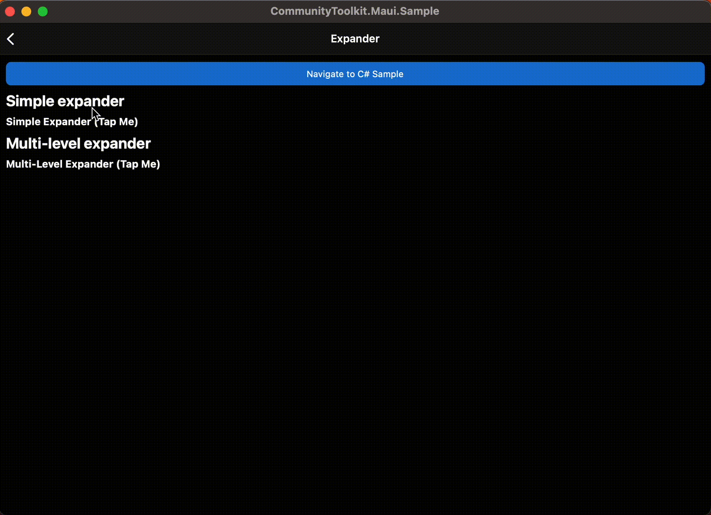

# Expander

The `Expander` control provides an expandable container to host any content. The control has two main properties to store your content:

## Header

This `Header` property can be provided with any view to allow for full customization. The `Header` will always be visible and interacting with it (clicking or tapping) will show/collapse the `Content`.

> [!NOTE]
> It is not recommended to place controls inside the header that allow user interaction.

## Content

This is the main content that will show when the `Header` property is interacted with it (clicked or tapped) or the `IsExpanded` property is modified.

> [!NOTE]
> `Expander` is not supported inside `ListView` on iOS/MacCatalyst and throws NotSupportedException. However, it can be replaced with the custom implementation by setting `public Action<TappedEventArgs>? HandleHeaderTapped { get; set; }`. This action is executed each time the header tapped. Please pay attention, by changing this action you may receive different behavior in `CollectionView` and `ListView` on all platforms.



## Basic usage

The following examples show how to use the `Expander` view by setting the `Header` property to be a `Label` control and the `Content` to be a `HorizontalStackLayout` with an `Image` and a `Label` inside.

### XAML

#### Including the XAML namespace

[!INCLUDE [XAML usage guidance](../includes/xaml-usage.md)]

#### Using the Expander

The following example shows how to add an `Expander` view in XAML.

```xml
<toolkit:Expander>
    <toolkit:Expander.Header>
        <Label Text="Baboon"
               FontAttributes="Bold"
               FontSize="Medium" />
    </toolkit:Expander.Header>
    <HorizontalStackLayout Padding="10">
        <Image Source="http://upload.wikimedia.org/wikipedia/commons/thumb/f/fc/Papio_anubis_%28Serengeti%2C_2009%29.jpg/200px-Papio_anubis_%28Serengeti%2C_2009%29.jpg"
               Aspect="AspectFill"
               HeightRequest="120"
               WidthRequest="120" />
        <Label Text="Baboons are African and Arabian Old World monkeys belonging to the genus Papio, part of the subfamily Cercopithecinae."
               FontAttributes="Italic" />
    </HorizontalStackLayout>
</toolkit:Expander>
```

### C#

The following example shows how to add an `Expander` view in C#.

```csharp
using CommunityToolkit.Maui.Views;

var expander = new Expander
{
    Header = new Label
    {
        Text = "Baboon",
        FontAttributes = FontAttributes.Bold,
        FontSize = Device.GetNamedSize(NamedSize.Medium, typeof(Label))
    }
};

expander.Content = new HorizontalStackLayout
{
    Padding = new Thickness(10),

    Children =
    {
        new Image
        {
            Source = "http://upload.wikimedia.org/wikipedia/commons/thumb/f/fc/Papio_anubis_%28Serengeti%2C_2009%29.jpg/200px-Papio_anubis_%28Serengeti%2C_2009%29.jpg",
            Aspect = Aspect.AspectFill,
            HeightRequest = 120,
            WidthRequest = 120
        },

        new Label
        {
            Text = "Baboons are African and Arabian Old World monkeys belonging to the genus Papio, part of the subfamily Cercopithecinae.",
            FontAttributes = FontAttributes.Italic
        }
    }
};
```

### C# Markup

```csharp
using CommunityToolkit.Maui.Views;

Content = new Expander
{
    Header = new Label()
        .Text("Baboon")
        .Font(bold: true, size: 18),

    Content = new HorizontalStackLayout
    {
        new Image()
            .Source("http://upload.wikimedia.org/wikipedia/commons/thumb/f/fc/Papio_anubis_%28Serengeti%2C_2009%29.jpg/200px-Papio_anubis_%28Serengeti%2C_2009%29.jpg")
            .Size(120)
            .Aspect(Aspect.AspectFill),

        new Label()
            .Text("Baboons are African and Arabian Old World monkeys belonging to the genus Papio, part of the subfamily Cercopithecinae.")
            .Font(italic: true)

    }.Padding(10)

}.CenterHorizontal();
```

## Properties

|Property  |Type  |Description  |
|---------|---------|---------|
`Command` | `ICommand` | Executes when the `Expander` header is tapped.
`CommandParameter` | `object` | The parameter that's passed to `Command`.
`Direction` | `ExpandDirection` | Defines the expander direction.
`Content` | `IView?` | Defines the content to be displayed when the `Expander` expands.
`Header` | `IView?` | Defines the header content.
`IsExpanded` | `bool` | Determines if the `Expander` is expanded. This property uses the `TwoWay` binding mode, and has a default value of `false`.

The `ExpandDirection` enumeration defines the following members:

|Value  |Description  |
|---------|---------|
| `Down` | Indicates that the `Expander` content is under the header. |
| `Up` | Indicates that the `Expander` content is above the header. |

The `Expander` control also defines a `ExpandedChanged` event that's fired when the `Expander` header is tapped.

### ExpandedChangedEventArgs

Event argument which contains `Expander` `IsExpanded` state.

#### Properties

|Property  |Type  |Description  |
|---------|---------|---------|
| IsExpanded | `bool` | Determines if the `Expander` is expanded. |

## Examples

You can find an example of this feature in action in the [.NET MAUI Community Toolkit Sample Application](https://github.com/CommunityToolkit/Maui/blob/main/samples/CommunityToolkit.Maui.Sample/Pages/Views/Expander/).

## API

You can find the source code for `Expander` over on the [.NET MAUI Community Toolkit GitHub repository](https://github.com/CommunityToolkit/Maui/blob/main/src/CommunityToolkit.Maui/Views/Expander).
