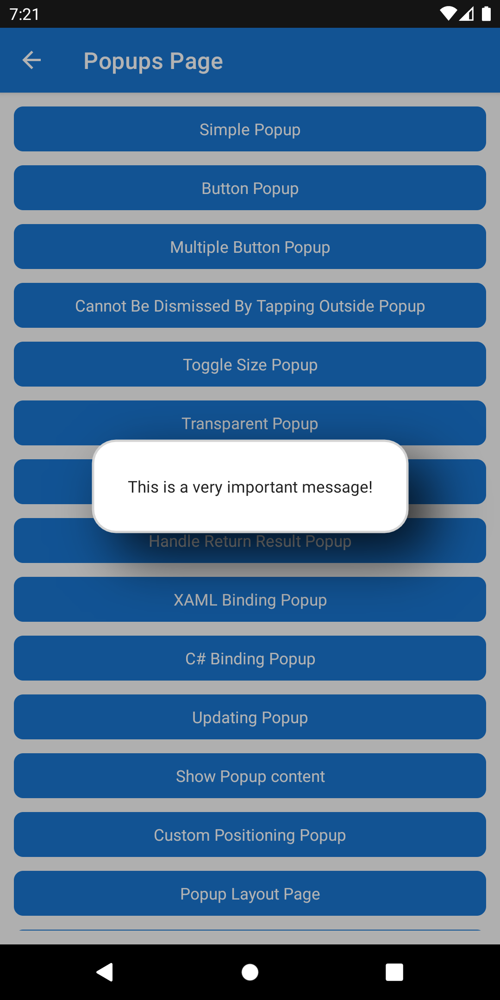

# Popup

Popups are a very common way of presenting information to a user that relates to their current task. Operating systems provide a way to show a message and require a response from the user, these alerts are typically restrictive in terms of the content a developer can provide and also the layout and appearance.

> [!NOTE]
> If you wish to present something to the user that is more subtle then checkout our [Toast](../alerts/toast.md) and [Snackbar](../alerts/snackbar.md) options.

The `Popup` view allows developers to build their own custom UI and present it to their users.

The .NET MAUI Community Toolkit provides 2 approaches to create a `Popup` that can be shown in a .NET MAUI application. These approaches will depend on the use case. This page focuses on the simplest form of `Popup` - simply rendering an overlay in an application, for the more advanced approach enabling the ability to return a result from the `Popup` please refer to [Popup - Returning a result](./popup/popup-result.md).

## Building a Popup

A `Popup` can be created in XAML or C# as follows:

### XAML

The following section covers how to create a `Popup` using XAML.

#### Defining your Popup

Please note that if a `Popup` is created in XAML it must have a C# code behind file as well. To understand why this is required please refer to this [.NET MAUI documentation page](/dotnet/maui/xaml/runtime-load).

The easiest way to create a `Popup` is to add a new `.NET MAUI ContentView (XAML)` to your project, this will create 2 files; a _*.xaml_ file and a _*.xaml.cs_ file. The contents of each file can be replaced with the following:

##### .xaml

```xaml
<ContentView
    xmlns="http://schemas.microsoft.com/dotnet/2021/maui"
    xmlns:x="http://schemas.microsoft.com/winfx/2009/xaml"
    HorizontalOptions="Center"
    VerticalOptions="Center"
    x:Class="MyProject.SimplePopup">

    <Label Text="This is a very important message!" />
    
</ContentView>
```

The default values for `HorizontalOptions` and `VerticalOptions` will result in the `Popup` filling the page that it overlays. The example sets both properties to `Center` to allow the popup size to be determined by the size of its contents.

##### .xaml.cs

```csharp
public partial class SimplePopup : ContentView
{
    public SimplePopup()
    {
        InitializeComponent();
    }
}
```

> [!IMPORTANT]
> If the code behind file is not created along with the call to `InitializeComponent` then an exception will be thrown when trying to display your `Popup`.

### C#

The following section covers how to create a `Popup` using C#.

```csharp
using CommunityToolkit.Maui.Views;

var popup = new ContentView
{
    HorizontalOptions = LayoutOptions.Center,
    VerticalOptions = LayoutOptions.Center,
    Content = new Label
    {
        Text = "This is a very important message!"
    }
};
```

## Presenting a Popup

Once the `Popup` has been built it can then be presented through the use of the `Popup` extension methods used on a `Page`, `Shell` or an `INavigation`, or through the [`IPopupService`](popup-service.md) implementation from this toolkit.

The following example shows how to instantiate and show the `SimplePopup` created in the previous example through a method on a `ContentPage`.

```csharp
using CommunityToolkit.Maui.Views;

public class MyPage : ContentPage
{
    public void DisplayPopup()
    {
        var popup = new SimplePopup();

        this.ShowPopup(popup);
    }
}
```


A popup will present without any `Padding` by default. In order to make the `SimplePopup` look better a `Padding` of 10 can be added as follows

```xaml
<ContentView
    xmlns="http://schemas.microsoft.com/dotnet/2021/maui"
    xmlns:x="http://schemas.microsoft.com/winfx/2009/xaml"
    HorizontalOptions="Center"
    VerticalOptions="Center"
    Padding="10"
    x:Class="MyProject.SimplePopup">

    <Label Text="This is a very important message!" />
    
</ContentView>
```



## Closing a Popup

There are 2 different ways that a `Popup` can be closed; programmatically or by tapping outside of the popup.

### Programmatically closing a Popup

In order to close a `Popup` a developer must call `Close` or `CloseAsync` on the `Popup` itself. This is typically performed by responding to a button press from a user or once a long running task has completed.

To show how a `Popup` can be closed programmatically, the `SimplePopup` XAML example can be enhanced by:

- changing the `ContentView` element to `VerticalStackLayout`
- adding an **OK** `Button`

```xaml
<VerticalStackLayout
    xmlns="http://schemas.microsoft.com/dotnet/2021/maui"
    xmlns:x="http://schemas.microsoft.com/winfx/2009/xaml"
    HorizontalOptions="Center"
    VerticalOptions="Center"
    Padding="10"
    Spacing="6"
    x:Class="MyProject.SimplePopup">

    <Label Text="This is a very important message!" />
    <Button Text="OK" 
            Clicked="OnOKButtonClicked" />
    
</VerticalStackLayout>
```

In the resulting event handler `OnOKButtonClicked` we call `Close`, this will programmatically close the `Popup`.

```csharp
public partial class SimplePopup : VerticalStackLayout
{
    // ...

    void OnOKButtonClicked(object? sender, EventArgs e) => Close();
}
```


> [!NOTE]
> `Close()` is a fire-and-forget method. It will complete and return to the calling thread before the operating system has dismissed the `Popup` from the screen. If you need to pause the execution of your code until the operating system has dismissed the `Popup` from the screen, use instead `CloseAsync()`.

Alternatively in the resulting event handler `OnOKButtonClicked` we call `CloseAsync`, this will programmatically close the `Popup` allowing the caller to `await` the method until the operating system has dismissed the `Popup` from the screen.

```csharp
public partial class SimplePopup : VerticalStackLayout
{
    // ...

    async void OnOKButtonClicked(object? sender, EventArgs e) 
    {
        var cts = new CancellationTokenSource(TimeSpan.FromSeconds(5));

         await CloseAsync(token: cts.Token);
         await Toast.Make("Popup Dismissed By Button").Show();
    }
}
```

### Tapping outside of the Popup

By default a user can tap outside of the `Popup` to dismiss it. This can be controlled through the use of the `PopupOptions.CanBeDismissedByTappingOutsideOfPopup` property. Setting this property to `false` will prevent a user from being able to dismiss the `Popup` by tapping outside of it. See [PopupOptions](./popup/popup-options.md) for more details.

## Events

The `Popup` class provides the following events that can be subscribed to.

|Event | Description  |
|---------|---------|
| `Closed` | Occurs when the `Popup` is closed. |
| `Opened` | Occurs when the `Popup` is opened. |

## Examples

You can find an example of this feature in action in the [.NET MAUI Community Toolkit Sample Application](https://github.com/CommunityToolkit/Maui/blob/main/samples/CommunityToolkit.Maui.Sample/Pages/Views/Popup/).

## API

You can find the source code for `Popup` over on the [.NET MAUI Community Toolkit GitHub repository](https://github.com/CommunityToolkit/Maui/tree/main/src/CommunityToolkit.Maui/Views/Popup).

## Additional Resources

- [`IPopupService`](popup-service.md)
- [`Popup` - Returning a result](./popup/popup-result.md)
- [`PopupOptions` - Customizing a `Popup` behavior and appearance](./popup/popup-options.md)
