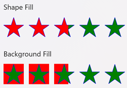
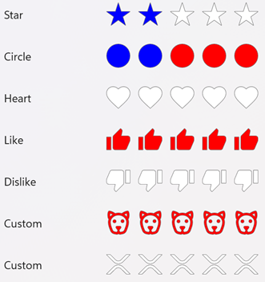

# RatingView

The .NET MAUI Community Toolkit `RatingView` is an `ItemTemplate` designed to provide developers with a flexible and customizable rating mechanism, similar to those used on popular review and feedback platforms.

## Syntax

### Including the XAML namespace

[!INCLUDE [XAML usage guidance](../includes/xaml-usage.md)]

### Using the RatingView

The following example shows how to create a `RatingView`:


```xaml
<ContentPage
	x:Class="CommunityToolkit.Maui.Sample.Pages.MyPage"
	xmlns="http://schemas.microsoft.com/dotnet/2021/maui"
	xmlns:x="http://schemas.microsoft.com/winfx/2009/xaml"
	xmlns:toolkit="http://schemas.microsoft.com/dotnet/2022/maui/toolkit">
	<VerticalStackLayout>
		<toolkit:RatingView
			EmptyShapeColor="White"
			FillColor="Blue"
			FillOption ="Shape"
			IsReadOnly="False"
			ShapePadding="3,7,7,3"
			ShapeDiameter="37"
			MaximumRating="5"
			Rating="4.5"
			Shape="Star"
			ShapeBorderColor="Red"
			ShapeBorderThickness="1"
			Spacing="3" />
	</VerticalStackLayout>
</ContentPage>
```

The equivalent C# code is:

```csharp
using CommunityToolkit.Maui.Views;

partial class MyPage : ContentPage
{
	public MyPage()
	{
		RatingView ratingView = new()
		{
			EmptyShapeColor = Colors.White,
			FillColor = Colors.Blue,
			FillOption = RatingViewFillOption.Shape,
			IsReadOnly = false,
			ShapePadding = new Thickness(3,7,7,3),
			ShapeDiameter = 37,
			MaximumRating = 5,
			Rating = 4.5,
			Shape = RatingViewShape.Star,
			ShapeBorderColor = Colors.Red,
			ShapeBorderThickness = 1,
			Spacing = 3,
		};

		Content = ratingView;
	}
}
```

## Properties

| Property | Type | Description |
|---|---|---|
| CustomShapePath | `string` | Gets or sets the SVG path for a custom rating view shape. This is a bindable property. |
| EmptyShapeColor | `Color` | Gets or sets the color that is applied to the unfilled (empty) rating shape.  The default value is Transparent.  This is a bindable property. |
| FillColor | `Color` | Gets or sets the color of the fill used to display the current rating.  Set `FillOption` to apply this color to `RatingViewFillOption.Background` or `RatingViewFillOption.Shape`. The default value is Yellow. This is a bindable property. |
| IsReadOnly | `bool` | Gets whether this layout is readonly. The default value is false.  This is a bindable property. |
| Shape | `RatingViewShape` | Gets or sets the rating item shape.  The property is of type [`RatingViewShape`](#set-shape) and is an enumeration. The default value is Star.  This is a bindable property. |
| ShapeDiameter | `double` | Gets or sets the shape diameter in points.  The default value is 20. |
| MaximumRating | `int` | Gets or sets the maximum number of ratings. The range of this value is 1 to 25; the default value is 5. This is a bindable property. |
| RatingChanged | `EventHandler<RatingChangedEventArgs>` | Event occurs when the rating is changed. |
| FillOption | `RatingViewFillOption` | Gets or sets the element to fill when a Rating is set. The property is of type [`RatingViewFillOption `](#set-fill-option) and is an enumeration. The default value of this property is `RatingViewFillOption .Shape`.  This is a bindable property. |
| Rating | `double` | Gets or sets a value indicating the current rating value, allowing for both pre-defined ratings (e.g., from previous user input or stored data) and updates during runtime as the user interacts with the control.  The default value is 0.  This is a bindable property. |
| ShapeBorderColor | `Color` | Gets or sets the border color of the rating item shape. The default value of this is Grey.  This is a bindable property. |
| ShapeBorderThickness | `Thickness` | Gets or sets the border thickness of the rating item shape.  The default value is a Thickness with all values set to 1.  This is a bindable property. |

> [!TIP]
> Additional base class properties can be found in the [HorizontalStackLayout Class](/dotnet/api/microsoft.maui.controls.horizontalstacklayout).

## Set custom shape path
The `CustomShapePath` property is a `string` that allows for the defining of custom SVG path. This feature enables developers to implement unique SVG shapes, such as distinctive symbols, as rating items.

> [!IMPORTANT]
> `CustomShapePath` is only used when the `Shape` property is set to `Shape.Custom`. Setting `Shape.Custom` when `CustomShapePath is null` will throw an `InvalidOperationException`: Unable to draw RatingViewShape.Custom because CustomShapePath is null. Please provide an SVG Path to CustomShapePath.

The following examples sets the custom and shape properties:


```xaml
<toolkit:RatingView
	CustomShapePath ="M 12 0C5.388 0 0 5.388 0 12s5.388 12 12 12 12-5.38 12-12c0-6.612-5.38-12-12-12z"
	Shape="Custom" />
```

The equivalent C# code is:

```csharp
RatingView ratingView = new()
{
	CustomShapePath = "M 12 0C5.388 0 0 5.388 0 12s5.388 12 12 12 12-5.38 12-12c0-6.612-5.38-12-12-12z",
	Shape = RatingViewShape.Custom,
};
```

For more information about custom shapes, see [Shapes.Path](/dotnet/api/microsoft.maui.controls.shapes.path).

## Set empty color
The `EmptyShapeColor` property is a `Color` that for the unfilled (empty) rating shapes. This allows for clear visual differentiation between rated and unrated shapes.

The following examples set the empty color property:

```xaml
<toolkit:RatingView
	EmptyShapeColor="Grey" />
```

The equivalent C# code is:

```csharp
RatingView ratingView = new()
{
	EmptyShapeColor = Colors.Grey,
};
```

## Set filled (rated) color
The `FillColor` property is a `Color` that will be applied to the filled (rated) portion of each shape, offering flexibility in defining the visual aesthetic of the rating items when selected by the user. Use `FillOption` to apply this color to the `RatingViewFillOption.Background` or the `RatingViewFillOption.Shape`.

The following examples set the filled color property:

```xaml
<toolkit:RatingView
	FillColor="Green" />
```

The equivalent C# code is:

```csharp
RatingView ratingView = new()
{
	FillColor = Colors.Green,
};
```

## Set is read only
The `IsReadOnly` property is a `bool` that will enable or disable the user from modifying the `Rating` value by tapping on the `RatingView`.

The following examples set the is read only property:

```xaml
<toolkit:RatingView
	IsReadOnly="True" />
```

The equivalent C# code is:

```csharp
RatingView readOnlyRatingView = new()
{
	IsReadOnly = True,
};
```

## Set shape padding
The `ShapePadding` property is a `Thickness` for the padding between the rating control and its corresponding shapes, allowing for finer control over the appearance and layout of the rating shapes.

The following examples set the item padding property:

```xaml
<toolkit:RatingView
	ItemPadding="3, 7, 7, 3" />
```

The equivalent C# code is:

```csharp
RatingView ratingView = new()
{
	ItemPadding = new Tickness(3, 7, 7, 3),
};
```

## Set shape diameter
The `ShapeDiameter` property is a `double` that customizes the shape size to fit the overall design of the application, providing the flexibility to adjust the control to various UI layouts.

The following examples set the item padding property:

```xaml
<toolkit:RatingView
	ShapeDiameter="37" />
```

The equivalent C# code is:

```csharp
RatingView ratingView = new()
{
	ShapeDiameter = 37,
};
```

## Set maximum rating
The `MaximumRating` property is a `int` for setting the total number of items (e.g., stars, hearts, etc., or custom shapes) available for rating. This allows for ratings of any scale, such as a 5-star or 10-star system, depending on the needs of the application. The range of this value is 1 to 25; the default value is 5.

> [!NOTE]
> If the value is set to 1, the control will toggle the rating between 0 and 1 when clicked/tapped.  If the value is set below the current `Rating`, the rating is adjusted accordingly.

The following examples set the maximum rating property:

```xaml
<toolkit:RatingView
	MaximumRating="7" />
```

The equivalent C# code is:

```csharp
RatingView ratingView = new()
{
	MaximumRating = 7,
};
```

## Set fill option
The `FillOption` property is an `enum` of type `RatingViewFillOption` for setting how the fill is applied when the `Rating` is set, enabling more nuanced visual presentation, such as filling only the interior of the shapes or the full item.  The available options are:

- `Shape` - (default) Fill the RatingView shape.
- `Background` - Fill the background behind the shape

The following examples set the rating fill property:



```xaml
<toolkit:RatingView
	FillOption="Shape" />
<toolkit:RatingView
	FillOption ="Background" />
```

The equivalent C# code is:

```csharp
RatingView shapeFillRatingView = new()
{
	FillOption = RatingViewFillOption.Shape,
};
RatingView itemFillRatingView = new()
{
	FillOption = RatingViewFillOption.Background,
};
```

## Set rating
The `Rating` property is a `double` for setting the current rating value, allowing for both pre-defined ratings (e.g., from previous user input or stored data) and updates during runtime as the user interacts with the control.

The following examples set the rating property:

```xaml
<toolkit:RatingView
	Rating="3.73" />
```

The equivalent C# code is:

```csharp
RatingView ratingView = new()
{
	Rating = 3.73,
};
```

## Handle rating changed event
The `RatingChanged` event has the argument type of `RatingChangedEventArgs`.  The event is raised when the `Rating` property is changed, and the element `IsReadOnly` is false.

The `RatingChangedEventArgs` exposes a single property:
- `Rating` - The new rating value.

The following examples show how to attach the event:

```xaml
<toolkit:RatingView
	RatingChanged="RatingView_RatingChanged" />
```

The equivalent C# code is:

```csharp
	RatingView ratingView = new();
	ratingView.RatingChanged += RatingView_RatingChanged;
```

The following example is the code behind to handle the event:

```csharp
void RatingView_RatingChanged(object sender, RatingChangedEventArgs e)
{
	double newRating = e.Rating;
	// The developer can then perform further actions (such as save to DB).
}
```

## Set shape
The `Shape` property is an `enum` of type `RatingViewShape` for setting the rating item shape of the ratings, such as stars, circles, like, dislike, or any other commonly used rating icons..  The available options are:

- `Star` - (default)
- `Heart`
- `Circle`
- `Like`
- `Dislike`
- `Custom` - Requires `CustomShapePath` to first be defined; will throw `InvalidOperationException` if `CustomShapePath` is `null`

The following examples set the rating fill property:



```xaml
<toolkit:RatingView
	Shape="Star" />
<toolkit:RatingView
	Shape="Heart" />
<toolkit:RatingView
	Shape="Circle" />
<toolkit:RatingView
	Shape="Like" />
<toolkit:RatingView
	Shape="Dislike" />
<toolkit:RatingView
        CustomShapePath="M 12 0C5.388 0 0 5.388 0 12s5.388 12 12 12 12-5.38 12-12c0-6.612-5.38-12-12-12z"
	Shape="Custom" />
```

The equivalent C# code is:

RatingView starRatingView = new()
{
	Shape = RatingViewShape.Star,
};
RatingView heartRatingView = new()
{
	Shape = RatingViewShape.Heart,
};
RatingView circleRatingView = new()
{
	Shape = RatingViewShape.Circle,
};
RatingView likeRatingView = new()
{
	Shape = RatingViewShape.Like,
};
RatingView dislikeRatingView = new()
{
	Shape = RatingViewShape.Dislike,
};
RatingView customRatingView = new()
{
        CustomShapePath = "M 12 0C5.388 0 0 5.388 0 12s5.388 12 12 12 12-5.38 12-12c0-6.612-5.38-12-12-12z",
	Shape = RatingViewShape.Custom,
};
};
```

## Set shape border color
The `ShapeBorderColor` is a `Color` for setting the border color of the rating item shape. This provides additional flexibility to create visually distinct and stylized rating shapes with custom borders.

The following examples set the shape border color property:

```xaml
<toolkit:RatingView
	ShapeBorderColor="Grey" />
```

The equivalent C# code is:

```csharp
RatingView ratingView = new()
{
	ShapeBorderColor = Colors.Grey,
};
```

## Set shape border thickness
The `ShapeBorderThickness` is a `double` for setting the thickness of the shape border. This provides additional flexibility to create visually distinct and stylized rating shapes with custom borders.

The following examples set the shape border thickness property:

```xaml
<toolkit:RatingView
	ShapeBorderThickness="3" />
```

The equivalent C# code is:

```csharp
RatingView ratingView = new()
{
	ShapeBorderThickness = 3,
};
```

## Examples

You can find examples of this control in action in the .NET MAUI Community Toolkit Sample Application:
- [XAML Syntax](https://github.com/CommunityToolkit/Maui/blob/main/samples/CommunityToolkit.Maui.Sample/Pages/Views/RatingView/RatingViewXamlPage.xaml)
- [C# Syntax](https://github.com/CommunityToolkit/Maui/blob/main/samples/CommunityToolkit.Maui.Sample/Pages/Views/RatingView/RatingViewCsharpPage.cs)
- [Showcase](https://github.com/CommunityToolkit/Maui/blob/main/samples/CommunityToolkit.Maui.Sample/Pages/Views/RatingView/RatingViewShowcasePage.xaml)

## API

You can find the source code for `RatingView` over on the [.NET MAUI Community Toolkit GitHub repository](https://github.com/CommunityToolkit/Maui/blob/main/src/CommunityToolkit.Maui/ImageSourcesViews/RatingView/RatingView.shared.cs).