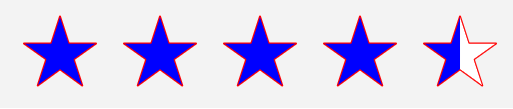

# RatingView

The .NET MAUI Community Toolkit `RatingView` is a control designed to provide developers with a flexible and customizable rating mechanism, similar to those used on popular review and feedback platforms.


## Syntax

### Including the XAML namespace

[!INCLUDE [XAML usage guidance](../includes/xaml-usage.md)]

### Using the RatingView

The following example shows how to create a `RatingView`:



```xaml
<ContentPage
	x:Class="CommunityToolkit.Maui.Sample.Pages.MyPage"
	xmlns="http://schemas.microsoft.com/dotnet/2021/maui"
	xmlns:x="http://schemas.microsoft.com/winfx/2009/xaml"
	xmlns:toolkit="http://schemas.microsoft.com/dotnet/2022/maui/toolkit">
	<VerticalStackLayout>
		<toolkit:RatingView
			EmptyColor="White"
			FilledColor="Blue"
			IsReadOnly="False"
			ItemPadding="3,7,7,3"
			ItemShapeSize="37"
			MaximumRating="5"
			RatingFill="Shape"
			Rating="4.5"
			ItemShape="Star"
			ShapeBorderColor="Red"
			ShapeBorderThickness="1"
			Spacing="3" />
	</VerticalStackLayout>
</ContentPage>
```

The equivalent C# code is:

```csharp
using CommunityToolkit.Maui.Views;

partial class MyPage : ContentPage
{
	public MyPage()
	{
		RatingView ratingView = new()
		{
			EmptyColor = Colors.White,
			FilledColor = Colors.Blue,
			IsReadOnly = false,
			ItemPadding = new Thickness(3,7,7,3),
			ItemShapeSize = 37,
			MaximumRating = 5,
			RatingFill = RatingFillElement.Shape,
			Rating = 4.5,
			ItemShape = RatingViewShape.Star,
			ShapeBorderColor = Colors.Red,
			ShapeBorderThickness = 1,
			Spacing = 3,
		};

		Content = ratingView;
	}
}
```

## Properties

| Property | Type | Description |
|---|---|---|
| CustomItemShape | `string` | Gets or sets the `Path` for custom rating item shapes. This is a bindable property. |
| EmptyColor | `Color` | Gets or sets the color that is applied to the unfilled (empty) rating items.  The default value is Transparent.  This is a bindable property. |
| FilledColor | `Color` | Gets or sets the Color that is applied to the filled (rated) portion of each rating item.  The default value is Yellow. This is a bindable property. |
| IsReadOnly | `bool` | Gets whether this layout is readonly. The default value is false.  This is a bindable property. |
| ItemShape | `RatingViewShape` | Gets or sets the rating item shape.  The property is of type [`RatingViewShape`](#set-item-shape) and is an enumeration. The default value is Star.  This is a bindable property. |
| ItemShapeSize | `double` | Gets or sets the size of the rating item shape.  The default value is 20. |
| MaximumRating | `byte` | Gets or sets the maximum number of ratings. The range of this value is 1 to 25; values outside this range will be set to the nearest valid value.  The default value is 5. This is a bindable property. |
| RatingChanged | `EventHandler<RatingChangedEventArgs>` | Event occurs when the rating is changed. |
| RatingFill | `RatingFillElement` | Gets or sets a value indicating how the fill is applied against the entire rating item or just the shape. The property is of type [`RatingFillElement`](#set-rating-fill) and is an enumeration. The default value of this property is Shape.  This is a bindable property. |
| Rating | `double` | Gets or sets a value indicating the current rating value, allowing for both pre-defined ratings (e.g., from previous user input or stored data) and updates during runtime as the user interacts with the control.  The default value is 0.  This is a bindable property. |
| ShapeBorderColor | `Color` | Gets or sets the border color of the rating item shape. The default value of this is Grey.  This is a bindable property. |
| ShapeBorderThickness | `Thickness` | Gets or sets the border thickness of the rating item shape.  The default value is a Thickness with all values set to 1.  This is a bindable property. |

> [!TIP]
> Additional base class properties can be found in the [HorizontalStackLayout Class](/dotnet/api/microsoft.maui.controls.horizontalstacklayout).

## Set custom item shape
The `CustomItemShape` property is a `string` that allows for the defining of custom rating item shape `path`. This feature empowers developers to implement unique designs, such as distinctive symbols, as rating items.

> [!IMPORTANT]
> Only when the `ItemShape` property is set to `Custom`, will the custom shape path be used.

The following examples sets the custom and shape properties:


```xaml
<toolkit:RatingView
	CustomItemShape="M 12 0C5.388 0 0 5.388 0 12s5.388 12 12 12 12-5.38 12-12c0-6.612-5.38-12-12-12z"
	ItemShape="Custom" />
```

The equivalent C# code is:

```csharp
RatingView ratingView = new()
{
	CustomItemShape = "M 12 0C5.388 0 0 5.388 0 12s5.388 12 12 12 12-5.38 12-12c0-6.612-5.38-12-12-12z",
	ItemShape = RatingViewShape.Custom,
};
```

For more information about custom shapes, see [Shapes.Path](/dotnet/api/microsoft.maui.controls.shapes.path).

## Set empty color
The `EmptyColor` property is a `Color` that for the unfilled (empty) rating items. This allows for clear visual differentiation between rated and unrated items.

The following examples set the empty color property:

```xaml
<toolkit:RatingView
	EmptyColor="Grey" />
```

The equivalent C# code is:

```csharp
RatingView ratingView = new()
{
	EmptyColor = Colors.Grey,
};
```

## Set filled (rated) color
The `FilledColor` property is a `Color` that will be applied to the filled (rated) portion of each item, offering flexibility in defining the visual aesthetic of the rating items when selected by the user.

The following examples set the filled color property:

```xaml
<toolkit:RatingView
	FilledColor="Green" />
```

The equivalent C# code is:

```csharp
RatingView ratingView = new()
{
	FilledColor = Colors.Green,
};
```

## Set is read only
The `IsReadOnly` property is a `bool` that will set the control user interface to read only.

The following examples set the is read only property:

```xaml
<toolkit:RatingView
	IsReadOnly="True" />
```

The equivalent C# code is:

```csharp
RatingView readOnlyRatingView = new()
{
	IsReadOnly = True,
};
```

## Set item padding
The `ItemPadding` property is a `Thickness` for the padding between the rating item and its corresponding shape, allowing for finer control over the appearance and layout of the rating items.

The following examples set the item padding property:

```xaml
<toolkit:RatingView
	ItemPadding="3, 7, 7, 3" />
```

The equivalent C# code is:

```csharp
RatingView ratingView = new()
{
	ItemPadding = new Tickness(3, 7, 7, 3),
};
```

## Set item shape size
The `ItemShapeSize` property is a `double` that customizes the shape size to fit the overall design of the application, providing the flexibility to adjust the control to various UI layouts.

The following examples set the item padding property:

```xaml
<toolkit:RatingView
	ItemShapeSize="37" />
```

The equivalent C# code is:

```csharp
RatingView ratingView = new()
{
	ItemShapeSize = 37,
};
```

## Set maximum rating
The `MaximumRating` property is a `byte` for setting the total number of items (e.g., stars, hearts, etc., or custom shapes) available for rating. This allows for ratings of any scale, such as a 5-star or 10-star system, depending on the needs of the application.

> [!NOTE]
> If the value is set to 1, the control will toggle the rating between 0 and 1 when clicked/tapped.  If the value is set below the current `Rating`, the rating is adjusted accordingly.

The following examples set the maximum rating property:

```xaml
<toolkit:RatingView
	MaximumRating="7" />
```

The equivalent C# code is:

```csharp
RatingView ratingView = new()
{
	MaximumRating = 7,
};
```

## Set rating fill
The `RatingFill` property is an `enum` of type `RatingFillElement` for setting how the fill is applied against the entire rating item or just the shape, enabling more nuanced visual presentation, such as filling only the interior of stars or the full item.  The available options are:

- `Shape` - (default) The filled (rated) portion of each item is applied to the item shape.
- `Item` - The filled (rated) portion of each item is applied to the item.

The following examples set the rating fill property:


```xaml
<toolkit:RatingView
	RatingFill="Shape" />
<toolkit:RatingView
	RatingFill="Item" />
```

The equivalent C# code is:

```csharp
RatingView shapeFillRatingView = new()
{
	RatingFill = RatingFillElement.Shape,
};
RatingView itemFillRatingView = new()
{
	RatingFill = RatingFillElement.Item,
};
```

## Set rating
The `Rating` property is a `double` for setting the current rating value, allowing for both pre-defined ratings (e.g., from previous user input or stored data) and updates during runtime as the user interacts with the control.

The following examples set the rating property:

```xaml
<toolkit:RatingView
	Rating="3.73" />
```

The equivalent C# code is:

```csharp
RatingView ratingView = new()
{
	Rating = 3.73,
};
```

## Handle rating changed event
The `RatingChanged` event has the argument type of `RatingChangedEventArgs`.  The event is raised when the `Rating` property is changed, and the element `IsReadOnly` is false.

The `RatingChangedEventArgs` exposes a single property:
- `Rating` - The new rating value.

The following examples show how to attach the event:

```xaml
<toolkit:RatingView
	RatingChanged="RatingView_RatingChanged" />
```

The equivalent C# code is:

```csharp
	RatingView ratingView = new();
	ratingView.RatingChanged += RatingView_RatingChanged;
```

The following example is the code behind to handle the event:

```csharp
void RatingView_RatingChanged(object sender, RatingChangedEventArgs e)
{
	double newRating = e.Rating;
	// The developer can then perform further actions (such as save to DB).
}
```

## Set item shape
The `ItemShape` property is an `enum` of type `RatingViewShape` for setting the rating item shape of the rating items, such as stars, circles, like, dislike, or any other commonly used rating icons..  The available options are:

- `Star` - (default)
- `Heart`
- `Circle`
- `Like`
- `Dislike`
- `Custom` - If set and `CustomItemShape` is NULL or empty, defaults to `Star`

The following examples set the rating fill property:


```xaml
<toolkit:RatingView
	ItemShape="Star" />
<toolkit:RatingView
	ItemShape="Heart" />
<toolkit:RatingView
	ItemShape="Circle" />
<toolkit:RatingView
	ItemShape="Like" />
<toolkit:RatingView
	ItemShape="Dislike" />
<toolkit:RatingView
	ItemShape="Custom" />
```

The equivalent C# code is:

```csharp
RatingView starRatingView = new()
{
	ItemShape = RatingViewShape.Star,
};
RatingView heartRatingView = new()
{
	ItemShape = RatingViewShape.Heart,
};
RatingView circleRatingView = new()
{
	ItemShape = RatingViewShape.Circle,
};
RatingView likeRatingView = new()
{
	ItemShape = RatingViewShape.Like,
};
RatingView dislikeRatingView = new()
{
	ItemShape = RatingViewShape.Dislike,
};
RatingView customRatingView = new()
{
	ItemShape = RatingViewShape.Custom,
};
```

## Set shape border color
The `ShapeBorderColor` is a `Color` for setting the border color of the rating item shape. This provides additional flexibility to create visually distinct and stylized rating shapes with custom borders.

The following examples set the shape border color property:

```xaml
<toolkit:RatingView
	ShapeBorderColor="Grey" />
```

The equivalent C# code is:

```csharp
RatingView ratingView = new()
{
	ShapeBorderColor = Colors.Grey,
};
```

## Set shape border thickness
The `ShapeBorderThickness` is a `double` for setting the thickness of the shape border. This provides additional flexibility to create visually distinct and stylized rating shapes with custom borders.

The following examples set the shape border thickness property:

```xaml
<toolkit:RatingView
	ShapeBorderThickness="3" />
```

The equivalent C# code is:

```csharp
RatingView ratingView = new()
{
	ShapeBorderThickness = 3,
};
```

## Examples

You can find examples of this control in action in the .NET MAUI Community Toolkit Sample Application:
- [XAML Syntax](https://github.com/CommunityToolkit/Maui/blob/main/samples/CommunityToolkit.Maui.Sample/Pages/Views/RatingView/RatingViewXamlPage.xaml)
- [C# Syntax](https://github.com/CommunityToolkit/Maui/blob/main/samples/CommunityToolkit.Maui.Sample/Pages/Views/RatingView/RatingViewCsharpPage.cs)
- [Showcase](https://github.com/CommunityToolkit/Maui/blob/main/samples/CommunityToolkit.Maui.Sample/Pages/Views/RatingView/RatingViewShowcasePage.xaml)

## API

You can find the source code for `RatingView` over on the [.NET MAUI Community Toolkit GitHub repository](https://github.com/CommunityToolkit/Maui/blob/main/src/CommunityToolkit.Maui/ImageSourcesViews/RatingView/RatingView.shared.cs).