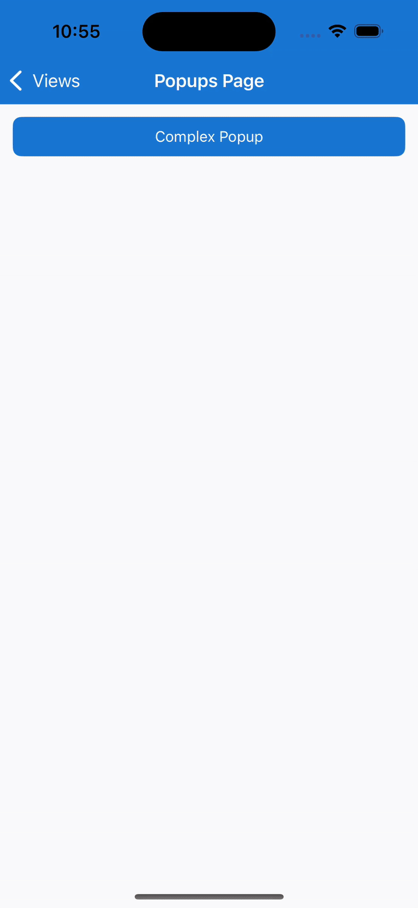

# Popups - Combining Popup features to provide a comprehensive example

This page makes use of the following features to provide a comprehensive example:

- [`Popup`](../popup.md)
- [`IPopupService`](../popup-service.md)
- [`PopupOptions` - Customizing a `Popup` behavior and appearance](./popup-options.md)
- [`Popup` - Returning a result](./popup-result.md)

The example involves creating a popup and view model pairing, registering this pair with the dependency injection services, binding the `PopupOptions` to the current pages view model, showing the Popup using the `PopupService` and finally having the `Popup` view model return a result when the button is tapped by the user.

## Creating the ComplexPopupViewModel

This will serve as the view model for the popup.

> [!IMPORTANT]
> Please note that this example relies on using the .NET Community Toolkit. For information on how to use this please refer to the [.NET Community Toolkit](../../../mvvm/index.md) documentation.

```csharp
using CommunityToolkit.Mvvm.ComponentModel;
using CommunityToolkit.Mvvm.Input;

namespace CommunityToolkit.Maui.Sample.ViewModels.Views;

public partial class ComplexPopupViewModel(IPopupService popupService) : ObservableObject
{
    readonly IPopupService popupService = popupService;
    readonly INavigation navigation = 
        Application.Current?.Windows[0].Page?.Navigation ??
        throw new InvalidOperationException("Unable to locate INavigation");
    
    [ObservableProperty, NotifyCanExecuteChangedFor(nameof(ReturnButtonTappedCommand))]
    public partial string ReturnText { get; set; } = string.Empty;

    bool CanReturnButtonExecute => ReturnText?.Length > 0;

    [RelayCommand(CanExecute = nameof(CanReturnButtonExecute))]
    async Task OnReturnButtonTapped(CancellationToken token)
    {
        await popupService.ClosePopupAsync<string>(navigation, ReturnText, token);
    }
}
```

## Creating the ComplexPopup

This will serve as the content of the popup to be displayed.

The easiest way to create a `Popup<T>` is to add a new `.NET MAUI ContentView (XAML)` to your project, this will create 2 files; a _*.xaml_ file and a _*.xaml.cs_ file. The contents of each file can be replaced with the following:

### XAML File

```XAML
<?xml version="1.0" encoding="utf-8"?>

<toolkit:Popup xmlns="http://schemas.microsoft.com/dotnet/2021/maui"
           xmlns:x="http://schemas.microsoft.com/winfx/2009/xaml"
           xmlns:toolkit="http://schemas.microsoft.com/dotnet/2022/maui/toolkit"
           xmlns:vm="clr-namespace:CommunityToolkit.Maui.Sample.ViewModels.Views"
           xmlns:system="clr-namespace:System;assembly=System.Runtime"
           x:Class="CommunityToolkit.Maui.Sample.Views.Popups.ComplexPopup"
           x:DataType="vm:ComplexPopupViewModel"
           x:TypeArguments="system:String">

    <toolkit:Popup.Resources>
        <toolkit:AppThemeColor Light="Black" Dark="Black" x:Key="TextColor" />
    </toolkit:Popup.Resources>

    <VerticalStackLayout Spacing="12">
        
        <Label Text="Complex Popup"
               TextColor="{toolkit:AppThemeResource TextColor}"
               FontSize="24"
               HorizontalTextAlignment="Center"
               VerticalTextAlignment="Center"
               HorizontalOptions="Center"
               VerticalOptions="Center"
               FontAttributes="Bold" />

        <Label x:Name="DescriptionLabel"
               Text="This text will change upon the Opened event firing"
               TextColor="{toolkit:AppThemeResource TextColor}"
               HorizontalTextAlignment="Center"
               VerticalTextAlignment="Center"
               HorizontalOptions="Center"
               VerticalOptions="Center"
               LineBreakMode="WordWrap" />

        <Entry Placeholder="Enter text here then click Return"
               HorizontalOptions="Center"
               VerticalOptions="Center"
               Text="{Binding ReturnText, Mode=OneWayToSource}" 
               TextColor="{toolkit:AppThemeResource TextColor}"/>

        <Button Text="Return"
                HorizontalOptions="Center"
                VerticalOptions="Center"
                Command="{Binding ReturnButtonTappedCommand}" />

    </VerticalStackLayout>
    
</toolkit:Popup>
```

### XAML Code-Behind File

```csharp
using CommunityToolkit.Maui.Sample.ViewModels.Views;
using CommunityToolkit.Maui.Views;

namespace CommunityToolkit.Maui.Sample.Views.Popups;

public partial class ComplexPopup : Popup<string>
{
    public ComplexPopup(ComplexPopupViewModel viewModel)
    {
        InitializeComponent();

        CanBeDismissedByTappingOutsideOfPopup = false;

        BindingContext = viewModel;
        Opened += HandlePopupOpened;
    }

    async void HandlePopupOpened(object? sender, EventArgs e)
    {
        // Delay for one second to ensure the user sees the previous text
        await Task.Delay(TimeSpan.FromSeconds(1));
        DescriptionLabel.Text = "This Popup demonstrates constructor injection to pass in a value using Dependency Injection using PopupService, demonstrates how to use the Opened event to trigger an action once the Popup appears, demonstrates how to bind to PopupOptions, and demonstrates how to return a result.";
    }
}
```

## Registering the Popup with Dependency Injection

Inside the `MauiProgram.cs` file the following line needs to be added to the `CreateMauiApp` method in order to register the `ComplexPopup` and `ComplexPopupViewModel` types with dependency injection but to also make it possible to use the `IPopupService` to display the popup.

```csharp
services.AddTransientPopup<ComplexPopup, ComplexPopupViewModel>();
```

## Creating the PopupsPageViewModel

This will serve as the view model for the page used to display the popup.

```csharp
using CommunityToolkit.Mvvm.ComponentModel;
using CommunityToolkit.Mvvm.Input;

namespace CommunityToolkit.Maui.Sample.ViewModels.Views;

public partial class PopupsViewModel(IPopupService popupService) : BaseViewModel
{
    static INavigation currentNavigation => Application.Current?.Windows[0].Page?.Navigation ?? throw new InvalidOperationException($"{nameof(Page.Navigation)} not found");

    [ObservableProperty]
    public partial Color PageOverlayBackgroundColor { get; set; } = Colors.Orange.WithAlpha(0.2f);

    [RelayCommand]
    async Task OnComplexPopupOpened(CancellationToken token)
    {
        // Rotate the PopupOptions.PageOverlayBackgroundColor every second
        while (!token.IsCancellationRequested)
        {
            PageOverlayBackgroundColor = Color.FromRgba(Random.Shared.NextDouble(), Random.Shared.NextDouble(), Random.Shared.NextDouble(), 0.2f);
            await Task.Delay(TimeSpan.FromSeconds(1), CancellationToken.None);
        }
    }
}
```

## Creating the PopupsPage

### XAML File

```XAML
<ContentPage
    xmlns="http://schemas.microsoft.com/dotnet/2021/maui"
    xmlns:x="http://schemas.microsoft.com/winfx/2009/xaml"
    xmlns:pages="clr-namespace:CommunityToolkit.Maui.Sample.Pages"
    xmlns:viewModels="clr-namespace:CommunityToolkit.Maui.Sample.ViewModels.Views"
    x:Class="CommunityToolkit.Maui.Sample.Pages.Views.PopupsPage"
    Title="Popups Page"
    x:DataType="viewModels:PopupsViewModel">

    <Button Text="Complex Popup" Clicked="HandleComplexPopupClicked" />

</ContentPage>
```

### XAML Code-Behind File

```csharp
using CommunityToolkit.Maui.Alerts;
using CommunityToolkit.Maui.Extensions;
using CommunityToolkit.Maui.Markup;
using CommunityToolkit.Maui.Sample.Pages.Views.Popup;
using CommunityToolkit.Maui.Sample.ViewModels.Views;
using CommunityToolkit.Maui.Sample.Views.Popups;
using Microsoft.Maui.Controls.Shapes;

namespace CommunityToolkit.Maui.Sample.Pages.Views;

public partial class PopupsPage : ContentPage
{
    readonly IPopupService popupService;
    readonly PopupsViewModel viewModel;

    public PopupsPage(PopupsViewModel multiplePopupViewModel, IPopupService popupService)
    {
        this.popupService = popupService;
        this.viewModel = multiplePopupViewModel;

        InitializeComponent();

        BindingContext = multiplePopupViewModel;
    }

    async void HandleComplexPopupClicked(object? sender, EventArgs e)
    {
        var complexPopupOpenedCancellationTokenSource = new CancellationTokenSource();
        var complexPopupOptions = new PopupOptions
        {
            BindingContext = this.viewModel,
            Shape = new RoundRectangle
            {
                CornerRadius = new CornerRadius(4),
                StrokeThickness = 12,
                Stroke = Colors.Orange
            }
        };
        complexPopupOptions.SetBinding<PopupsViewModel, Color>(
            PopupOptions.PageOverlayColorProperty,
            static x => x.PageOverlayBackgroundColor);

        var popupResultTask = popupService.ShowPopupAsync<ComplexPopup, string>(
            Navigation,
            complexPopupOptions,
            CancellationToken.None);

        // Trigger Command in ViewModel to Rotate PopupOptions.PageOverlayColorProperty
        this.viewModel.ComplexPopupOpenedCommand.Execute(complexPopupOpenedCancellationTokenSource.Token);

        var popupResult = await popupResultTask;
        await complexPopupOpenedCancellationTokenSource.CancelAsync();

        if (!popupResult.WasDismissedByTappingOutsideOfPopup)
        {
            // Display Popup Result as a Toast
            await Toast.Make($"You entered {popupResult.Result}").Show(CancellationToken.None);
        }
    }
}
```

## The result



## Examples

You can find an example of this feature in action in the [.NET MAUI Community Toolkit Sample Application](https://github.com/CommunityToolkit/Maui/blob/main/samples/CommunityToolkit.Maui.Sample/Pages/Views/Popups/ComplexPopup.xaml).

## API

You can find the source code for `Popup` over on the [.NET MAUI Community Toolkit GitHub repository](https://github.com/CommunityToolkit/Maui/tree/main/src/CommunityToolkit.Maui/Views/Popup).

## Additional Resources

- [`Popup`](../popup.md)
- [`IPopupService`](../popup-service.md)
- [`PopupOptions` - Customizing a `Popup` behavior and appearance](./popup-options.md)
- [`Popup` - Returning a result](./popup-result.md)
