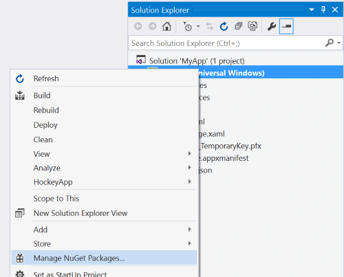

# Introduction to the MVVM Toolkit

The `CommunityToolkit.Mvvm` package (aka MVVM Toolkit, formerly named `Microsoft.Toolkit.Mvvm`) is a modern, fast, and modular MVVM library. It is part of the Windows Community Toolkit and is built around the following principles:

- **Platform and Runtime Independent** - **.NET Standard 2.0**, **.NET Standard 2.1** and **.NET 6** 🚀 (UI Framework Agnostic)
- **Simple to pick-up and use** - No strict requirements on Application structure or coding-paradigms (outside of 'MVVM'ness), i.e., flexible usage.
- **À la carte** - Freedom to choose which components to use.
- **Reference Implementation** - Lean and performant, providing implementations for interfaces that are included in the Base Class Library, but lack concrete types to use them directly.

The MVVM Toolkit is maintained and published by Microsoft, and part of the .NET Foundation. It is also used by several first party applications that are built into Windows, such as [the Microsoft Store](https://blogs.windows.com/windowsexperience/2021/06/24/building-a-new-open-microsoft-store-on-windows-11/).

This package targets **.NET Standard** so it can be used on any app platform: UWP, WinForms, WPF, Xamarin, Uno, and more; and on any runtime: .NET Native, .NET Core, .NET Framework, or Mono. It runs on all of them. The API surface is identical in all cases, making it perfect for building shared libraries.

Additionally, the MVVM Toolkit also has a **.NET 6** target, which is used to enable more internal optimizations when running on .NET 6. The public API surface is identical in both cases, so NuGet will always resolve the best possible version of the package without consumers having to worry about which APIs will be available on their platform.

## Getting started

To install the package from within Visual Studio:

1. In Solution Explorer, right-click on the project and select **Manage NuGet Packages**. Search for **CommunityToolkit.Mvvm** and install it.

    

2. Add a using or Imports directive to use the new APIs:

    ```c#
    using CommunityToolkit.Mvvm;
    ```

    ```vb
    Imports CommunityToolkit.Mvvm
    ```

3. Code samples are available in the other docs pages for the MVVM Toolkit, and in the [unit tests](https://github.com/CommunityToolkit/dotnet/tree/main/tests/CommunityToolkit.Mvvm.UnitTests) for the project.

## When should I use this package?

Use this package for access to a collection of standard, self-contained, lightweight types that provide a starting implementation for building modern apps using the MVVM pattern. These types alone are usually enough for many users to build apps without needing additional external references.

The included types are:

- **CommunityToolkit.Mvvm.ComponentModel**
  - [`ObservableObject`](ObservableObject.md)
  - [`ObservableRecipient`](ObservableRecipient.md)
  - [`ObservableValidator`](ObservableValidator.md)
- **CommunityToolkit.Mvvm.DependencyInjection**
  - [`Ioc`](Ioc.md)
- **CommunityToolkit.Mvvm.Input**
  - [`RelayCommand`](RelayCommand.md)
  - [`RelayCommand<T>`](RelayCommand.md)
  - [`AsyncRelayCommand`](AsyncRelayCommand.md)
  - [`AsyncRelayCommand<T>`](AsyncRelayCommand.md)
  - [`IRelayCommand`](RelayCommand.md)
  - [`IRelayCommand<T>`](RelayCommand.md)
  - [`IAsyncRelayCommand`](AsyncRelayCommand.md)
  - [`IAsyncRelayCommand<T>`](AsyncRelayCommand.md)
- **CommunityToolkit.Mvvm.Messaging**
  - [`IMessenger`](Messenger.md)
  - [`WeakReferenceMessenger`](Messenger.md)
  - [`StrongReferenceMessenger`](Messenger.md)
  - [`IRecipient<TMessage>`](Messenger.md)
  - [`MessageHandler<TRecipient, TMessage>`](Messenger.md)
- **CommunityToolkit.Mvvm.Messaging.Messages**
  - [`PropertyChangedMessage<T>`](/dotnet/api/CommunityToolkit.mvvm.Messaging.Messages.PropertyChangedMessage-1)
  - [`RequestMessage<T>`](/dotnet/api/CommunityToolkit.mvvm.Messaging.Messages.RequestMessage-1)
  - [`AsyncRequestMessage<T>`](/dotnet/api/CommunityToolkit.mvvm.Messaging.Messages.AsyncRequestMessage-1)
  - [`CollectionRequestMessage<T>`](/dotnet/api/CommunityToolkit.mvvm.Messaging.Messages.CollectionRequestMessage-1)
  - [`AsyncCollectionRequestMessage<T>`](/dotnet/api/CommunityToolkit.mvvm.Messaging.Messages.AsyncCollectionRequestMessage-1)
  - [`ValueChangedMessage<T>`](/dotnet/api/CommunityToolkit.mvvm.Messaging.Messages.ValueChangedMessage-1)

This package aims to offer as much flexibility as possible, so developers are free to choose which components to use.  All types are loosely-coupled, so that it's only necessary to include what you use. There is no requirement to go "all-in" with a specific series of all-encompassing APIs, nor is there a set of mandatory patterns that need to be followed when building apps using these helpers. Combine these building blocks in a way that best fits your needs.

## Additional resources

- Check out the [sample app](https://aka.ms/mvvmtoolkit/samples) (for multiple UI frameworks) to see the MVVM Toolkit in action.
- You can also find more examples in the [unit tests](https://github.com/CommunityToolkit/dotnet/tree/main/tests/CommunityToolkit.Mvvm.UnitTests).
